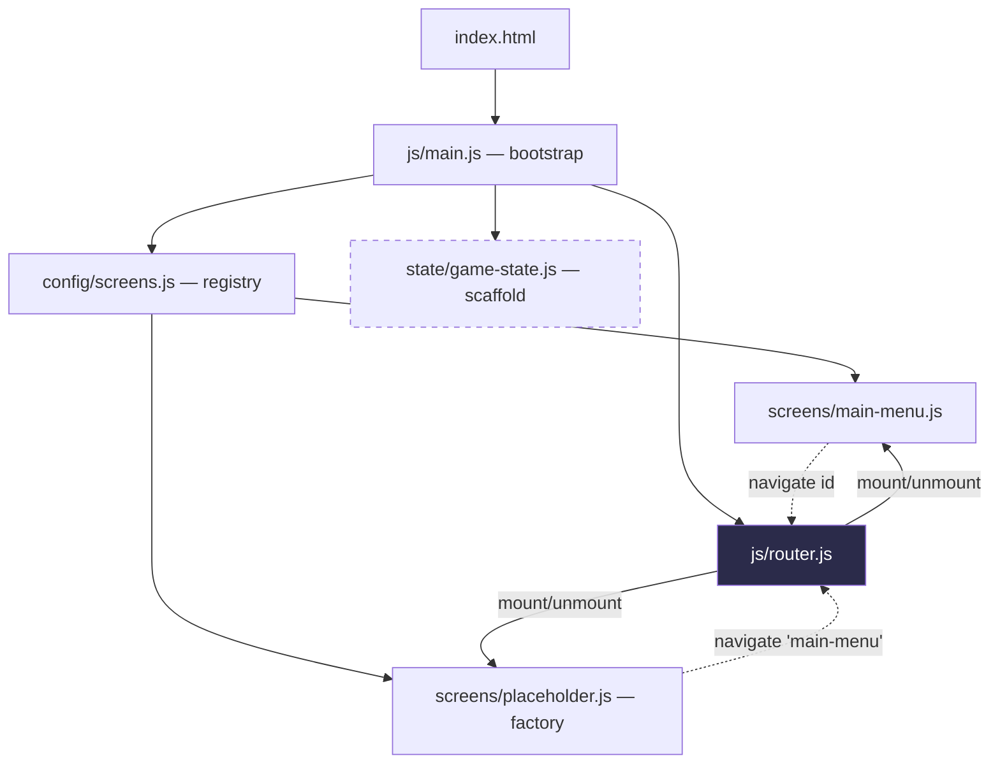
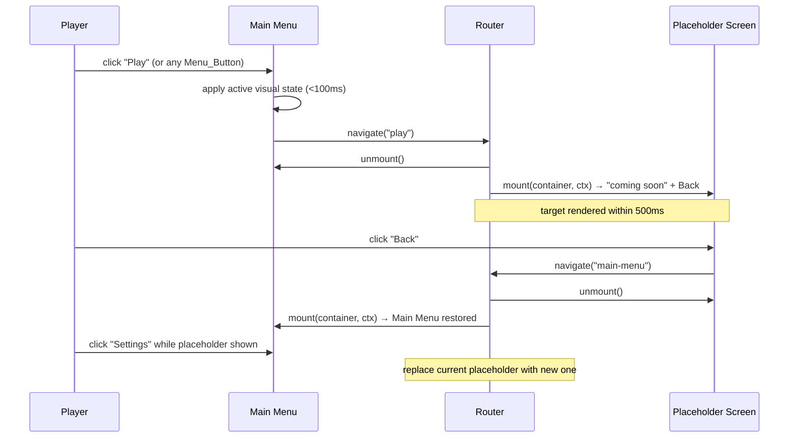

# Design Document

## Overview

Gemoria: Crystal Quest is an original HTML5 match-3 puzzle game with a fantasy crystal theme. This design covers **Phase 1 only**: the project foundation and a responsive, touch-friendly main menu with fully wired navigation and original placeholder artwork.

The guiding principle is *maintainability and extensibility over premature complexity*. Phase 1 ships a small, honest amount of code — an application bootstrap, a general-purpose screen Router, a Main Menu UI module, a placeholder-screen factory, a screen registry (config), and a minimal game-state scaffold. Everything else (the match-3 board, match detection, special gems, obstacles, boosters logic, levels, sound, animation, save/persistence) is deliberately **not implemented**. Instead, the architecture is shaped so those systems drop in later as new modules and new registered screens, without rewriting the Main Menu, the Router, or the bootstrap.

No framework, no backend, no database, no external runtime dependencies. Everything is HTML5, CSS3, and Vanilla JavaScript ES modules. All visual identity is original — no assets, layouts, characters, branding, sounds, or artwork from any existing commercial match-3 product are copied or imitated.

### Design Goals

- **General navigation, not menu-only.** The Router is a reusable screen-navigation system with a screen registry and a lifecycle contract (`mount` / `unmount`), so future screens (World Map, Level Select, Game Board, Boosters, Achievements, Settings, Results) plug in without touching Router internals.
- **Extension points, clearly marked.** A central game-state concept (pub/sub + `getState` / `setState` / `subscribe`) and a data-driven level system are described so future systems have a home, while Phase 1 implements only a minimal scaffold (or none) as noted per part.
- **Additive future phases.** Adding the game board later means registering a new screen and adding a new module — no edits to `main-menu.js`, `router.js`, or `main.js`.

### Interpretation Note on Requirements 1.4, 4.2, and 4.4 (Pragmatic Modularity)

Requirements 1.4 / 4.2 / 4.4 are read with a **relaxed, pragmatic interpretation**: each ES module has **one clearly defined primary responsibility**, and **all of its exports relate to that one concern**. This does **not** mean "exactly one export per module." A module MAY expose multiple related exports when technically appropriate (for example, the Router module may export a `createRouter` factory alongside a small `SCREENS` symbol/enum or a type-like constant that belongs to the routing concern). The single-responsibility rule is about cohesion of concern, not export count.

## Architecture

Phase 1 uses a thin layered architecture with one-directional dependencies. The bootstrap wires everything together at startup; nothing below the bootstrap imports the bootstrap.

```
index.html
  └─ loads css (reset/base, theme, menu)  +  <script type="module" src="js/main.js">

js/main.js  (bootstrap / entry point)
  ├─ imports screen registry (config/screens.js)
  ├─ imports createRouter (router.js)
  ├─ imports createStore (state/game-state.js)   ← Phase 1: minimal scaffold
  ├─ registers screens, mounts router into #app
  └─ navigates to the initial screen (main-menu)

router.js  (general screen navigation)
  ├─ holds a screen registry (id → screen factory/descriptor)
  ├─ navigate(screenId): unmount current, mount target
  └─ unknown id → no change + reports "screen not found"

config/screens.js  (screen registry data)
  └─ declares which screen ids exist and how to build them
     (main-menu → mainMenuScreen; play/world-map/boosters/
      achievements/settings → placeholder screens)

screens/main-menu.js       (UI module: renders the Main Menu)
screens/placeholder.js     (factory: builds a Placeholder screen for any feature)
state/game-state.js        (extension-point scaffold: store/pub-sub)
```

### Dependency Rule



Screens never import each other. Screens receive the ability to navigate through their lifecycle context (a `navigate` callback and, later, the store), so the Router remains the only thing that knows the set of screens.

### Navigation Flow (Phase 1)



## Components and Interfaces

### 1. `index.html` (entry point markup)

- Single HTML entry point at the **project root**.
- Declares `<meta name="viewport" content="width=device-width, initial-scale=1.0">`.
- Links three stylesheets in order: reset/base → theme → menu.
- Contains a single mount root: `<div id="app"></div>`.
- Contains a static, no-JS fallback error region (hidden by default) used if the module fails to load: `<div id="boot-error" hidden>…</div>`.
- References the entry module with exactly one `<script type="module" src="js/main.js"></script>`.
- Includes a `<noscript>` message and, to satisfy the "failed to load" requirement without JS, an inline `window.addEventListener('error', …)` guard is avoided in favor of a bootstrap `try/catch` (see Error Handling).

### 2. `js/main.js` — Bootstrap / Application Entry Point

**Primary responsibility:** initialize the application and wire modules together. It owns startup, nothing else.

```js
// main.js (shape, not final code)
import { createRouter } from './router.js';
import { screenRegistry } from './config/screens.js';
import { createStore } from './state/game-state.js';

export function boot(rootSelector = '#app') { /* ... */ }
```

Behavior:
1. Resolve the `#app` container; if missing, reveal `#boot-error`.
2. Create the store scaffold (Phase 1: minimal).
3. Create the Router with the container and `screenRegistry`.
4. Register each screen from the registry.
5. Navigate to the initial screen (`'main-menu'`).
6. Wrap 1–5 in `try/catch`; on failure, reveal the on-screen "failed to load" message (Requirement 2.5).

`boot()` is exported (for testability) and also invoked at module end so the game starts on load.

### 3. `js/router.js` — General Screen Navigation

**Primary responsibility:** switch the visible screen. It is the only module aware of the full screen set at runtime.

```js
// router.js (shape)
export function createRouter(container) {
  // registry: Map<string, ScreenDescriptor>
  return {
    register(id, screenFactory),      // add a screen; future screens plug in here
    navigate(id),                     // switch to screen id (single operation, Req 4.2)
    getCurrentScreenId(),             // introspection for tests
    hasScreen(id),                    // registry query
  };
}
```

- `navigate(id)`:
  - If `id` is **not** registered → leave current screen unchanged, and report "screen not found" (console warning + return a falsy/`false` result) per Requirements 4.3 and 3-of-Req-6 handling. No throw.
  - If registered → call `unmount()` on the current screen (if any), instantiate/`mount()` the target into the container, and record it as current.
- `register(id, factory)` is how the registry and future phases add screens **without modifying Router internals**.
- The Router depends only on the **Screen Lifecycle Contract**, never on concrete screen modules.

### 4. Screen Lifecycle Contract

Every screen — Main Menu, placeholders, and every future screen — conforms to this contract. This is the seam that keeps the Router general.

```js
/**
 * @typedef {Object} ScreenContext
 * @property {(id: string) => boolean} navigate  // request a screen switch
 * @property {Store} [store]                       // central state (future: read/update)
 *
 * @typedef {Object} Screen
 * @property {(container: HTMLElement, ctx: ScreenContext) => void} mount    // render into container
 * @property {() => void} [unmount]                                          // tear down / cleanup
 * @property {string} [title]                                                // optional display name
 */
```

- `mount(container, ctx)`: build DOM into `container`, wire event listeners, use `ctx.navigate(id)` for transitions.
- `unmount()`: remove listeners and clear its DOM. Optional; Router clears the container if absent.
- Screens are produced by **factories** (`() => Screen`) so each navigation gets a fresh, isolated instance.

### 5. `js/screens/main-menu.js` — Main Menu UI Module

**Primary responsibility:** render and manage the Main Menu (title, five buttons, artwork). Distinct from bootstrap and Router (Requirement 4.4).

- Renders the title text **"Gemoria: Crystal Quest"**.
- Renders exactly **five** `Menu_Button`s: `Play`, `World Map`, `Boosters`, `Achievements`, `Settings`, each mapped to a target screen id.
- Renders inline-SVG Placeholder_Artwork containing at least one crystal/gem shape.
- On button activation: apply an active visual state (`<100ms`, via CSS class toggle) then call `ctx.navigate(targetId)`.
- Button → screen id map (data, not hardcoded control flow):

  | Label | Screen id |
  |---|---|
  | Play | `play` |
  | World Map | `world-map` |
  | Boosters | `boosters` |
  | Achievements | `achievements` |
  | Settings | `settings` |

### 6. `js/screens/placeholder.js` — Placeholder Screen Factory

**Primary responsibility:** produce a "coming-soon" screen for any not-yet-built feature.

```js
export function createPlaceholderScreen({ title, message }) { /* returns Screen */ }
```

- `mount` renders the feature title, a "not yet available" message (Requirement 6.4 / 9.3), and a **Back** control that calls `ctx.navigate('main-menu')` (Requirements 6.5, 9.5).
- One factory serves all five placeholder destinations; the registry supplies per-feature `title`/`message`.

### 7. `js/config/screens.js` — Screen Registry

**Primary responsibility:** declare the set of screens and how to build each one. This is the single place that lists screens; adding a future screen is a registry entry plus a module.

```js
import { mainMenuScreen } from '../screens/main-menu.js';
import { createPlaceholderScreen } from '../screens/placeholder.js';

export const screenRegistry = [
  { id: 'main-menu', factory: () => mainMenuScreen() },
  { id: 'play',         factory: () => createPlaceholderScreen({ title: 'Play',         message: 'Crystal matching is coming soon.' }) },
  { id: 'world-map',    factory: () => createPlaceholderScreen({ title: 'World Map',    message: 'The realm map is coming soon.' }) },
  { id: 'boosters',     factory: () => createPlaceholderScreen({ title: 'Boosters',     message: 'Boosters are coming soon.' }) },
  { id: 'achievements', factory: () => createPlaceholderScreen({ title: 'Achievements', message: 'Achievements are coming soon.' }) },
  { id: 'settings',     factory: () => createPlaceholderScreen({ title: 'Settings',     message: 'Settings are coming soon.' }) },
];
```

Future phases replace a placeholder entry with a real screen (e.g., swap `play`'s factory to the game board, add `level-select`, `results`) — the Main Menu and Router remain untouched.

### 8. `js/state/game-state.js` — Central Game State (Extension-Point Scaffold)

**Primary responsibility:** provide a framework-free central store. **Phase 1 status: minimal scaffold only.** No progression, coins, lives, boosters, or level logic is implemented; those are documented shapes for future phases.

```js
// game-state.js (Phase 1 scaffold)
export function createStore(initialState = {}) {
  let state = { ...initialState };
  const subscribers = new Set();
  return {
    getState: () => state,
    setState: (patch) => { state = { ...state, ...patch }; subscribers.forEach(fn => fn(state)); },
    subscribe: (fn) => { subscribers.add(fn); return () => subscribers.delete(fn); },
  };
}
```

The bootstrap may create a store and pass it through `ScreenContext` so future systems read/update it without coupling to each other. In Phase 1 the Main Menu does not depend on store contents.

## Data Models

Phase 1 has almost no runtime data model beyond the screen registry. The models below are split into *Phase 1 (implemented)* and *Future (documented shape only)*.

### Phase 1 — Implemented

**ScreenDescriptor** (registry entry)
```
ScreenDescriptor = {
  id: string,                 // unique screen identifier, e.g. "main-menu"
  factory: () => Screen       // builds a fresh screen instance
}
```

**Screen** (runtime object — see Lifecycle Contract)
```
Screen = {
  mount(container: HTMLElement, ctx: ScreenContext): void,
  unmount?(): void,
  title?: string
}
```

**MenuItem** (Main Menu button data)
```
MenuItem = { label: string, screenId: string }
```

### Future — Documented Shape Only (NOT implemented in Phase 1)

**Central Game State** (future contents of the store)
```
GameState = {
  progression: { currentLevel: number, starsByLevel: Record<number, 0|1|2|3> },
  coins: number,
  lives: number,
  boosters: Record<string, number>,   // boosterId → count owned
  settings: { sound: boolean, music: boolean, reducedMotion: boolean }
}
```

**Data-Driven Level Schema** (future `data/levels/*.json`, loaded by a future level loader)
```
Level = {
  id: number,                 // 1..100+
  goals: Array<{ type: "clear-crystals" | "collect" | "score", target: number, ... }>,
  moves: number,              // move budget
  grid: { rows: number, cols: number },
  layout: string[],           // rows of cell codes: gem colors, blockers, empty
  obstacles?: Array<{ type: string, at: [number, number] }>,
  availableBoosters?: string[]
}
```
The intended loader concept: a future `level-loader.js` reads `levels/index.json` (a manifest of level ids) and fetches each `Level` on demand, so supporting **100+ levels** is a data change, not an engine change. The match-3 engine consumes a validated `Level` object and never hardcodes level content — this keeps the core engine stable as content grows.

## Correctness Properties

*A property is a characteristic or behavior that should hold true across all valid executions of a system — essentially, a formal statement about what the system should do. Properties serve as the bridge between human-readable specifications and machine-verifiable correctness guarantees.*

PBT applies to Phase 1's **pure navigation and rendering logic**: the Router's screen resolution over an arbitrary registry, and the data-driven rendering of menu buttons and placeholder screens. Visual/layout, timing, and structural-organization criteria are covered by example, edge-case, and smoke tests in the Testing Strategy rather than by properties (see prework classification). The properties below were consolidated during property reflection to remove redundancy (e.g., the general `navigate` properties subsume the "replace current placeholder", "block deferred invocation", and "respond to activation" criteria).

Screens are tested against a DOM (jsdom or a real browser via a test runner) and a spy `navigate`. The Router is tested with synthetic screen descriptors whose `mount`/`unmount` record calls.

### Property 1: Navigating to a registered screen makes it current from any prior state

*For any* screen registry containing a set of screen ids, *for any* starting current screen (including none), and *for any* target id that IS registered, calling `navigate(targetId)` SHALL unmount the previously mounted screen (if any), mount the target screen, and make the target the current screen.

**Validates: Requirements 4.2, 6.3**

### Property 2: Navigating to an unregistered screen leaves state unchanged and reports not-found

*For any* screen registry, *for any* currently mounted screen, and *for any* target id that is NOT registered, calling `navigate(targetId)` SHALL leave the current screen unchanged (no unmount, no new mount) and SHALL produce a "screen not found" indication.

**Validates: Requirements 4.3, 9.4**

### Property 3: The Main Menu renders one enabled, activatable button per menu item with a matching label

*For any* list of `MenuItem` records, mounting the Main Menu SHALL render exactly one enabled, activatable button per item, and each rendered button's label SHALL equal its item's label. (With the Phase 1 configuration this yields the five buttons Play, World Map, Boosters, Achievements, Settings.)

**Validates: Requirements 6.1, 10.3**

### Property 4: Activating a menu button navigates to that item's mapped screen id

*For any* `MenuItem` in the rendered Main Menu, activating that item's button SHALL call `navigate` exactly once with that item's `screenId`.

**Validates: Requirements 6.2, 9.3, 10.4**

### Property 5: A placeholder screen renders its title and not-yet-available message for any inputs

*For any* `{ title, message }` pair, mounting the placeholder screen produced by the factory SHALL render text containing that title and that message.

**Validates: Requirements 6.4**

### Property 6: A placeholder's Back control returns to the Main Menu

*For any* placeholder screen instance, activating its Back control SHALL call `navigate('main-menu')`.

**Validates: Requirements 6.5, 9.5**

## Error Handling

| Condition | Detection | Handling | Requirement |
|---|---|---|---|
| Entry module fails to load/execute | `boot()` wrapped in `try/catch`; missing `#app` checked explicitly | Reveal static `#boot-error` region with a visible "The game failed to load." message; never leave the viewport blank | 2.5, 10.2 |
| Unknown / unregistered screen id passed to `navigate` | Registry lookup miss | Leave current screen unchanged; `console.warn` a "screen not found: <id>" message and return `false` | 4.3, 9.4 |
| Placeholder artwork (inline SVG) fails to render | Screen renders a themed container that is styled with a solid theme background regardless of SVG success | Menu shows solid-color background fallback; all buttons remain in the DOM and interactive | 7.4 |
| CSS custom property undefined at render time | `var()` usages always include a fallback, e.g. `var(--crystal-primary, #4b3f9e)` | Element stays visible against its background using the fallback color | 3.6 |
| Syntax error / uncaught exception during load | Native browser console; bootstrap `try/catch` for wired code | Error indication surfaces in console; boot-error region shown for fatal startup failures | 10.1, 10.2 |

Design notes:
- The `#boot-error` element is **static markup in `index.html`** (hidden via the `hidden` attribute) so it can be revealed even if JS module loading fails entirely.
- The Router never throws on a bad id; "silent, non-destructive, reported" is the contract, which also serves as the guard for any attempt to reach a deferred (non-existent) Phase 1 target.

## Testing Strategy

The project is Vanilla JS with ES modules and no framework. Tests use a lightweight runner that supports ES modules and a DOM (recommended: a runner with jsdom, or headless-browser tests). Property tests use an established JS property-testing library (recommended: **fast-check**) — property tests are **not** implemented from scratch.

### Dual Approach

- **Property tests** — universal navigation/rendering logic (Properties 1–6). Each property test:
  - Runs a **minimum of 100 iterations** (fast-check default is adequate; set explicitly).
  - Is tagged with a comment referencing its design property, format:
    `// Feature: gemoria-crystal-quest, Property <number>: <property text>`
  - Is implemented as a **single** property test per correctness property.
  - Generators: arbitrary arrays of `MenuItem` (`{ label, screenId }`), arbitrary registries of synthetic screens, arbitrary registered/unregistered id pairs, arbitrary `{ title, message }` strings.

- **Example / unit tests** — specific, non-universal behaviors:
  - Boot renders the Main Menu into `#app` (2.1, 4.5, 5.1).
  - Title text equals "Gemoria: Crystal Quest" and remains present while mounted (5.1, 5.3).
  - Active-state CSS class toggles on button activation (6.6).
  - Menu renders inline `<svg>` with a crystal/gem shape and references **no** external image files (7.1, 7.2, 7.3, 7.5).
  - Touch-target computed styles meet 44×44px and ≥8px spacing (8.3).
  - **No-console-error check:** boot the app with a spy on `console.error` (and an `error`/`unhandledrejection` listener); assert zero errors from parse through initial Main Menu render (2.4, 10.1).

- **Edge-case tests:**
  - Force `boot()` failure (missing `#app` / thrown error) → `#boot-error` becomes visible (2.5, 10.2).
  - Render menu with artwork omitted/failing → buttons still present and activatable (7.4).
  - `var()` fallback presence check in CSS (3.6).

- **Smoke / structural checks** (run once; deterministic, non-input-varying):
  - Directory layout: markup at root, `css/` and `js/` separated by concern (1.1, 1.2, 1.3, 1.5).
  - `index.html` has exactly one `<script type="module">`, three stylesheet links, and the correct viewport meta (2.2, 2.3, 8.4).
  - Theme CSS defines colors + typography; base and menu CSS carry no theme color literals; colors are CSS custom properties (3.1–3.5).
  - Phase-1 scope: no board DOM and no deferred-system modules in the Phase 1 module graph (9.1, 9.2).

- **Manual / visual checks** (responsive layout, hard to assert reliably headless):
  - Single vertical column ≤768px with 16px side margins; centered, max-width 960px >768px (8.1, 8.2).
  - No horizontal overflow across 320–2560px; vertical scroll when content is tall (8.5, 8.6).
  - Title fully within viewport, not clipped, across breakpoints (5.2, 5.4).

### Run-over-HTTP note

ES modules are subject to CORS and will not load from `file://`. All tests and manual verification MUST serve the project over HTTP (for example, `python -m http.server` or `npx serve` from the project root, then open `http://localhost:<port>/`). This constraint, and the exact serve command, are documented in the README run instructions (10.5, 10.6). Opening `index.html` directly from the file system is not supported.

## Phase 1 vs Future Extension Points

| System / Component | Phase 1 status | Notes |
|---|---|---|
| `index.html` entry point | **Implemented** | Root, viewport meta, 3 CSS links, single module script, `#app` + `#boot-error`. |
| `js/main.js` bootstrap | **Implemented** | Wires registry + router + store scaffold; `try/catch` fallback. |
| `js/router.js` (general navigation) | **Implemented** | `register` / `navigate` / lifecycle contract; **general**, not menu-only. |
| Screen Lifecycle Contract (`mount`/`unmount`) | **Implemented** | The seam all future screens conform to. |
| `js/screens/main-menu.js` | **Implemented** | Title, 5 buttons, inline-SVG crystal artwork. |
| `js/screens/placeholder.js` factory | **Implemented** | "Coming-soon" + Back for all five destinations. |
| `js/config/screens.js` registry | **Implemented** | Declares screen ids; the single place new screens are added. |
| `js/state/game-state.js` store | **Minimal scaffold** | `getState`/`setState`/`subscribe` pub-sub only; no real contents used by the menu. |
| Central Game State contents (progression, coins, lives, boosters, settings) | **Future** | Documented `GameState` shape; store scaffold is the home for it. |
| Match-3 board & rendering | **Future** | Registered later by swapping `play`'s factory; no Main Menu/Router edits. |
| Match detection, special gems, obstacles | **Future** | New modules consumed by the future board screen. |
| Boosters logic | **Future** | New module + real `boosters` screen. |
| Levels / data-driven level system | **Future** | `data/levels/*.json` + `level-loader.js`; supports 100+ levels as data, not engine changes. |
| Sound, animation | **Future** | New modules; opt-in via store settings. |
| Save / persistence | **Future** | Future store adapter (e.g., `localStorage`); no schema in Phase 1. |
| World Map, Level Select, Achievements, Settings, Results screens | **Future** | Placeholders now; each becomes a registered screen implementing the contract. |

### How future phases stay additive

Adding the game board (or any screen) later is a two-step, non-invasive change:

1. Add a new screen module (e.g., `js/screens/game-board.js`) implementing `mount(container, ctx)` / `unmount()`.
2. Register it in `js/config/screens.js` — either a new id (`level-select`, `results`) or by replacing a placeholder's `factory` (e.g., point `play` at the board).

Because the bootstrap iterates the registry and the Router depends only on the lifecycle contract, **no changes are required to `main.js`, `router.js`, or `main-menu.js`**. The store scaffold, passed through `ScreenContext`, gives future systems a shared read/update channel without direct coupling between them.
