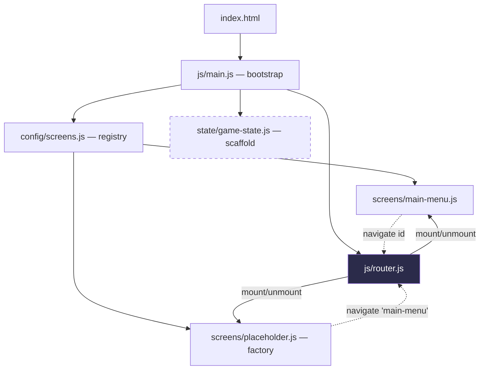
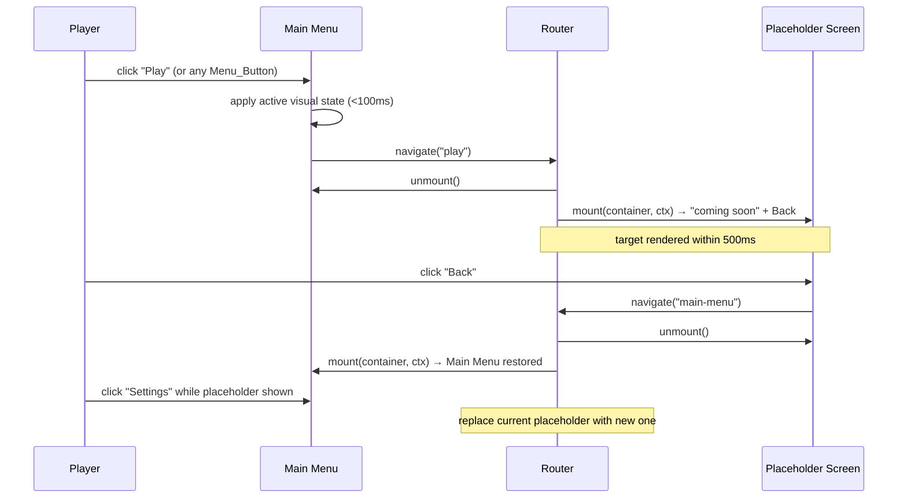
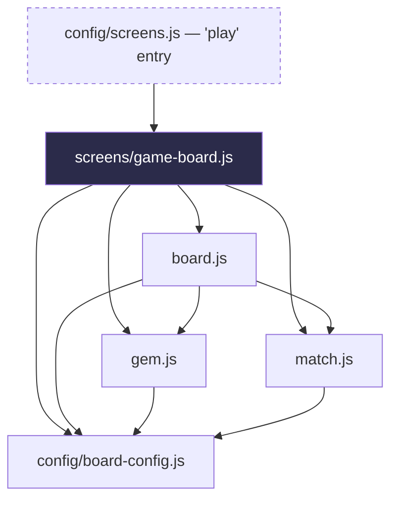
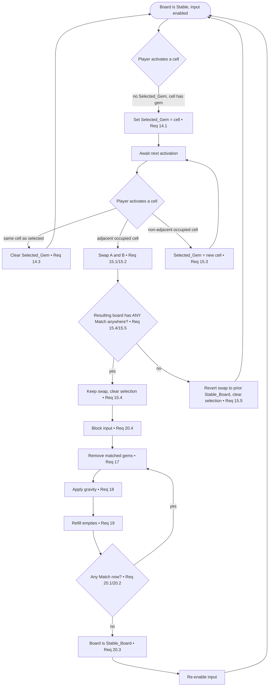
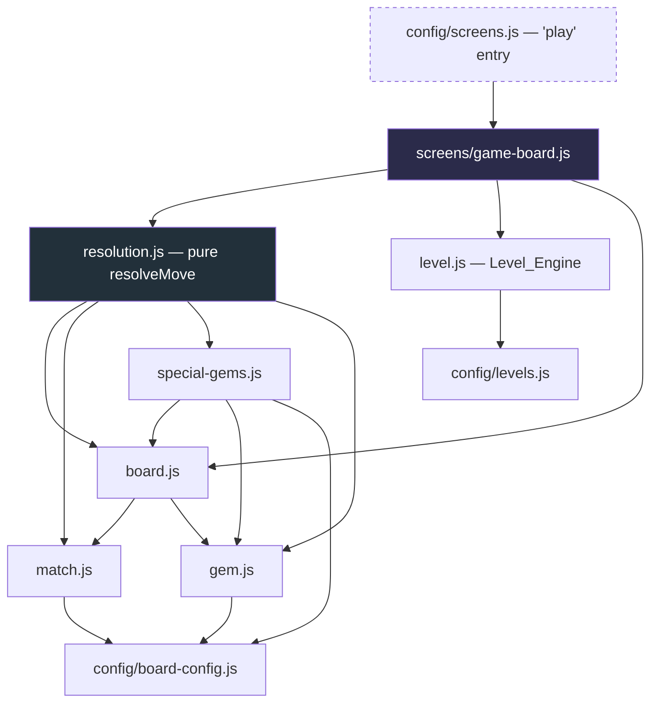

# Design Document

## Overview

Gemoria: Crystal Quest is an original HTML5 match-3 puzzle game with a fantasy crystal theme. This design covers **Phase 1 only**: the project foundation and a responsive, touch-friendly main menu with fully wired navigation and original placeholder artwork.

The guiding principle is *maintainability and extensibility over premature complexity*. Phase 1 ships a small, honest amount of code — an application bootstrap, a general-purpose screen Router, a Main Menu UI module, a placeholder-screen factory, a screen registry (config), and a minimal game-state scaffold. Everything else (the match-3 board, match detection, special gems, obstacles, boosters logic, levels, sound, animation, save/persistence) is deliberately **not implemented**. Instead, the architecture is shaped so those systems drop in later as new modules and new registered screens, without rewriting the Main Menu, the Router, or the bootstrap.

No framework, no backend, no database, no external runtime dependencies. Everything is HTML5, CSS3, and Vanilla JavaScript ES modules. All visual identity is original — no assets, layouts, characters, branding, sounds, or artwork from any existing commercial match-3 product are copied or imitated.

### Design Goals

- **General navigation, not menu-only.** The Router is a reusable screen-navigation system with a screen registry and a lifecycle contract (`mount` / `unmount`), so future screens (World Map, Level Select, Game Board, Boosters, Achievements, Settings, Results) plug in without touching Router internals.
- **Extension points, clearly marked.** A central game-state concept (pub/sub + `getState` / `setState` / `subscribe`) and a data-driven level system are described so future systems have a home, while Phase 1 implements only a minimal scaffold (or none) as noted per part.
- **Additive future phases.** Adding the game board later means registering a new screen and adding a new module — no edits to `main-menu.js`, `router.js`, or `main.js`.

### Interpretation Note on Requirements 1.4, 4.2, and 4.4 (Pragmatic Modularity)

Requirements 1.4 / 4.2 / 4.4 are read with a **relaxed, pragmatic interpretation**: each ES module has **one clearly defined primary responsibility**, and **all of its exports relate to that one concern**. This does **not** mean "exactly one export per module." A module MAY expose multiple related exports when technically appropriate (for example, the Router module may export a `createRouter` factory alongside a small `SCREENS` symbol/enum or a type-like constant that belongs to the routing concern). The single-responsibility rule is about cohesion of concern, not export count.

## Architecture

Phase 1 uses a thin layered architecture with one-directional dependencies. The bootstrap wires everything together at startup; nothing below the bootstrap imports the bootstrap.

```
index.html
  └─ loads css (reset/base, theme, menu)  +  <script type="module" src="js/main.js">

js/main.js  (bootstrap / entry point)
  ├─ imports screen registry (config/screens.js)
  ├─ imports createRouter (router.js)
  ├─ imports createStore (state/game-state.js)   ← Phase 1: minimal scaffold
  ├─ registers screens, mounts router into #app
  └─ navigates to the initial screen (main-menu)

router.js  (general screen navigation)
  ├─ holds a screen registry (id → screen factory/descriptor)
  ├─ navigate(screenId): unmount current, mount target
  └─ unknown id → no change + reports "screen not found"

config/screens.js  (screen registry data)
  └─ declares which screen ids exist and how to build them
     (main-menu → mainMenuScreen; play/world-map/boosters/
      achievements/settings → placeholder screens)

screens/main-menu.js       (UI module: renders the Main Menu)
screens/placeholder.js     (factory: builds a Placeholder screen for any feature)
state/game-state.js        (extension-point scaffold: store/pub-sub)
```

### Dependency Rule



Screens never import each other. Screens receive the ability to navigate through their lifecycle context (a `navigate` callback and, later, the store), so the Router remains the only thing that knows the set of screens.

### Navigation Flow (Phase 1)



## Components and Interfaces

### 1. `index.html` (entry point markup)

- Single HTML entry point at the **project root**.
- Declares `<meta name="viewport" content="width=device-width, initial-scale=1.0">`.
- Links three stylesheets in order: reset/base → theme → menu.
- Contains a single mount root: `<div id="app"></div>`.
- Contains a static, no-JS fallback error region (hidden by default) used if the module fails to load: `<div id="boot-error" hidden>…</div>`.
- References the entry module with exactly one `<script type="module" src="js/main.js"></script>`.
- Includes a `<noscript>` message and, to satisfy the "failed to load" requirement without JS, an inline `window.addEventListener('error', …)` guard is avoided in favor of a bootstrap `try/catch` (see Error Handling).

### 2. `js/main.js` — Bootstrap / Application Entry Point

**Primary responsibility:** initialize the application and wire modules together. It owns startup, nothing else.

```js
// main.js (shape, not final code)
import { createRouter } from './router.js';
import { screenRegistry } from './config/screens.js';
import { createStore } from './state/game-state.js';

export function boot(rootSelector = '#app') { /* ... */ }
```

Behavior:
1. Resolve the `#app` container; if missing, reveal `#boot-error`.
2. Create the store scaffold (Phase 1: minimal).
3. Create the Router with the container and `screenRegistry`.
4. Register each screen from the registry.
5. Navigate to the initial screen (`'main-menu'`).
6. Wrap 1–5 in `try/catch`; on failure, reveal the on-screen "failed to load" message (Requirement 2.5).

`boot()` is exported (for testability) and also invoked at module end so the game starts on load.

### 3. `js/router.js` — General Screen Navigation

**Primary responsibility:** switch the visible screen. It is the only module aware of the full screen set at runtime.

```js
// router.js (shape)
export function createRouter(container) {
  // registry: Map<string, ScreenDescriptor>
  return {
    register(id, screenFactory),      // add a screen; future screens plug in here
    navigate(id),                     // switch to screen id (single operation, Req 4.2)
    getCurrentScreenId(),             // introspection for tests
    hasScreen(id),                    // registry query
  };
}
```

- `navigate(id)`:
  - If `id` is **not** registered → leave current screen unchanged, and report "screen not found" (console warning + return a falsy/`false` result) per Requirements 4.3 and 3-of-Req-6 handling. No throw.
  - If registered → call `unmount()` on the current screen (if any), instantiate/`mount()` the target into the container, and record it as current.
- `register(id, factory)` is how the registry and future phases add screens **without modifying Router internals**.
- The Router depends only on the **Screen Lifecycle Contract**, never on concrete screen modules.

### 4. Screen Lifecycle Contract

Every screen — Main Menu, placeholders, and every future screen — conforms to this contract. This is the seam that keeps the Router general.

```js
/**
 * @typedef {Object} ScreenContext
 * @property {(id: string) => boolean} navigate  // request a screen switch
 * @property {Store} [store]                       // central state (future: read/update)
 *
 * @typedef {Object} Screen
 * @property {(container: HTMLElement, ctx: ScreenContext) => void} mount    // render into container
 * @property {() => void} [unmount]                                          // tear down / cleanup
 * @property {string} [title]                                                // optional display name
 */
```

- `mount(container, ctx)`: build DOM into `container`, wire event listeners, use `ctx.navigate(id)` for transitions.
- `unmount()`: remove listeners and clear its DOM. Optional; Router clears the container if absent.
- Screens are produced by **factories** (`() => Screen`) so each navigation gets a fresh, isolated instance.

### 5. `js/screens/main-menu.js` — Main Menu UI Module

**Primary responsibility:** render and manage the Main Menu (title, five buttons, artwork). Distinct from bootstrap and Router (Requirement 4.4).

- Renders the title text **"Gemoria: Crystal Quest"**.
- Renders exactly **five** `Menu_Button`s: `Play`, `World Map`, `Boosters`, `Achievements`, `Settings`, each mapped to a target screen id.
- Renders inline-SVG Placeholder_Artwork containing at least one crystal/gem shape.
- On button activation: apply an active visual state (`<100ms`, via CSS class toggle) then call `ctx.navigate(targetId)`.
- Button → screen id map (data, not hardcoded control flow):

  | Label | Screen id |
  |---|---|
  | Play | `play` |
  | World Map | `world-map` |
  | Boosters | `boosters` |
  | Achievements | `achievements` |
  | Settings | `settings` |

### 6. `js/screens/placeholder.js` — Placeholder Screen Factory

**Primary responsibility:** produce a "coming-soon" screen for any not-yet-built feature.

```js
export function createPlaceholderScreen({ title, message }) { /* returns Screen */ }
```

- `mount` renders the feature title, a "not yet available" message (Requirement 6.4 / 9.3), and a **Back** control that calls `ctx.navigate('main-menu')` (Requirements 6.5, 9.5).
- One factory serves all five placeholder destinations; the registry supplies per-feature `title`/`message`.

### 7. `js/config/screens.js` — Screen Registry

**Primary responsibility:** declare the set of screens and how to build each one. This is the single place that lists screens; adding a future screen is a registry entry plus a module.

```js
import { mainMenuScreen } from '../screens/main-menu.js';
import { createPlaceholderScreen } from '../screens/placeholder.js';

export const screenRegistry = [
  { id: 'main-menu', factory: () => mainMenuScreen() },
  { id: 'play',         factory: () => createPlaceholderScreen({ title: 'Play',         message: 'Crystal matching is coming soon.' }) },
  { id: 'world-map',    factory: () => createPlaceholderScreen({ title: 'World Map',    message: 'The realm map is coming soon.' }) },
  { id: 'boosters',     factory: () => createPlaceholderScreen({ title: 'Boosters',     message: 'Boosters are coming soon.' }) },
  { id: 'achievements', factory: () => createPlaceholderScreen({ title: 'Achievements', message: 'Achievements are coming soon.' }) },
  { id: 'settings',     factory: () => createPlaceholderScreen({ title: 'Settings',     message: 'Settings are coming soon.' }) },
];
```

Future phases replace a placeholder entry with a real screen (e.g., swap `play`'s factory to the game board, add `level-select`, `results`) — the Main Menu and Router remain untouched.

### 8. `js/state/game-state.js` — Central Game State (Extension-Point Scaffold)

**Primary responsibility:** provide a framework-free central store. **Phase 1 status: minimal scaffold only.** No progression, coins, lives, boosters, or level logic is implemented; those are documented shapes for future phases.

```js
// game-state.js (Phase 1 scaffold)
export function createStore(initialState = {}) {
  let state = { ...initialState };
  const subscribers = new Set();
  return {
    getState: () => state,
    setState: (patch) => { state = { ...state, ...patch }; subscribers.forEach(fn => fn(state)); },
    subscribe: (fn) => { subscribers.add(fn); return () => subscribers.delete(fn); },
  };
}
```

The bootstrap may create a store and pass it through `ScreenContext` so future systems read/update it without coupling to each other. In Phase 1 the Main Menu does not depend on store contents.

## Data Models

Phase 1 has almost no runtime data model beyond the screen registry. The models below are split into *Phase 1 (implemented)* and *Future (documented shape only)*.

### Phase 1 — Implemented

**ScreenDescriptor** (registry entry)
```
ScreenDescriptor = {
  id: string,                 // unique screen identifier, e.g. "main-menu"
  factory: () => Screen       // builds a fresh screen instance
}
```

**Screen** (runtime object — see Lifecycle Contract)
```
Screen = {
  mount(container: HTMLElement, ctx: ScreenContext): void,
  unmount?(): void,
  title?: string
}
```

**MenuItem** (Main Menu button data)
```
MenuItem = { label: string, screenId: string }
```

### Future — Documented Shape Only (NOT implemented in Phase 1)

**Central Game State** (future contents of the store)
```
GameState = {
  progression: { currentLevel: number, starsByLevel: Record<number, 0|1|2|3> },
  coins: number,
  lives: number,
  boosters: Record<string, number>,   // boosterId → count owned
  settings: { sound: boolean, music: boolean, reducedMotion: boolean }
}
```

**Data-Driven Level Schema** (future `data/levels/*.json`, loaded by a future level loader)
```
Level = {
  id: number,                 // 1..100+
  goals: Array<{ type: "clear-crystals" | "collect" | "score", target: number, ... }>,
  moves: number,              // move budget
  grid: { rows: number, cols: number },
  layout: string[],           // rows of cell codes: gem colors, blockers, empty
  obstacles?: Array<{ type: string, at: [number, number] }>,
  availableBoosters?: string[]
}
```
The intended loader concept: a future `level-loader.js` reads `levels/index.json` (a manifest of level ids) and fetches each `Level` on demand, so supporting **100+ levels** is a data change, not an engine change. The match-3 engine consumes a validated `Level` object and never hardcodes level content — this keeps the core engine stable as content grows.

## Correctness Properties

*A property is a characteristic or behavior that should hold true across all valid executions of a system — essentially, a formal statement about what the system should do. Properties serve as the bridge between human-readable specifications and machine-verifiable correctness guarantees.*

PBT applies to Phase 1's **pure navigation and rendering logic**: the Router's screen resolution over an arbitrary registry, and the data-driven rendering of menu buttons and placeholder screens. Visual/layout, timing, and structural-organization criteria are covered by example, edge-case, and smoke tests in the Testing Strategy rather than by properties (see prework classification). The properties below were consolidated during property reflection to remove redundancy (e.g., the general `navigate` properties subsume the "replace current placeholder", "block deferred invocation", and "respond to activation" criteria).

Screens are tested against a DOM (jsdom or a real browser via a test runner) and a spy `navigate`. The Router is tested with synthetic screen descriptors whose `mount`/`unmount` record calls.

### Property 1: Navigating to a registered screen makes it current from any prior state

*For any* screen registry containing a set of screen ids, *for any* starting current screen (including none), and *for any* target id that IS registered, calling `navigate(targetId)` SHALL unmount the previously mounted screen (if any), mount the target screen, and make the target the current screen.

**Validates: Requirements 4.2, 6.3**

### Property 2: Navigating to an unregistered screen leaves state unchanged and reports not-found

*For any* screen registry, *for any* currently mounted screen, and *for any* target id that is NOT registered, calling `navigate(targetId)` SHALL leave the current screen unchanged (no unmount, no new mount) and SHALL produce a "screen not found" indication.

**Validates: Requirements 4.3, 9.4**

### Property 3: The Main Menu renders one enabled, activatable button per menu item with a matching label

*For any* list of `MenuItem` records, mounting the Main Menu SHALL render exactly one enabled, activatable button per item, and each rendered button's label SHALL equal its item's label. (With the Phase 1 configuration this yields the five buttons Play, World Map, Boosters, Achievements, Settings.)

**Validates: Requirements 6.1, 10.3**

### Property 4: Activating a menu button navigates to that item's mapped screen id

*For any* `MenuItem` in the rendered Main Menu, activating that item's button SHALL call `navigate` exactly once with that item's `screenId`.

**Validates: Requirements 6.2, 9.3, 10.4**

### Property 5: A placeholder screen renders its title and not-yet-available message for any inputs

*For any* `{ title, message }` pair, mounting the placeholder screen produced by the factory SHALL render text containing that title and that message.

**Validates: Requirements 6.4**

### Property 6: A placeholder's Back control returns to the Main Menu

*For any* placeholder screen instance, activating its Back control SHALL call `navigate('main-menu')`.

**Validates: Requirements 6.5, 9.5**

## Error Handling

| Condition | Detection | Handling | Requirement |
|---|---|---|---|
| Entry module fails to load/execute | `boot()` wrapped in `try/catch`; missing `#app` checked explicitly | Reveal static `#boot-error` region with a visible "The game failed to load." message; never leave the viewport blank | 2.5, 10.2 |
| Unknown / unregistered screen id passed to `navigate` | Registry lookup miss | Leave current screen unchanged; `console.warn` a "screen not found: <id>" message and return `false` | 4.3, 9.4 |
| Placeholder artwork (inline SVG) fails to render | Screen renders a themed container that is styled with a solid theme background regardless of SVG success | Menu shows solid-color background fallback; all buttons remain in the DOM and interactive | 7.4 |
| CSS custom property undefined at render time | `var()` usages always include a fallback, e.g. `var(--crystal-primary, #4b3f9e)` | Element stays visible against its background using the fallback color | 3.6 |
| Syntax error / uncaught exception during load | Native browser console; bootstrap `try/catch` for wired code | Error indication surfaces in console; boot-error region shown for fatal startup failures | 10.1, 10.2 |

Design notes:
- The `#boot-error` element is **static markup in `index.html`** (hidden via the `hidden` attribute) so it can be revealed even if JS module loading fails entirely.
- The Router never throws on a bad id; "silent, non-destructive, reported" is the contract, which also serves as the guard for any attempt to reach a deferred (non-existent) Phase 1 target.

## Testing Strategy

The project is Vanilla JS with ES modules and no framework. Tests use a lightweight runner that supports ES modules and a DOM (recommended: a runner with jsdom, or headless-browser tests). Property tests use an established JS property-testing library (recommended: **fast-check**) — property tests are **not** implemented from scratch.

### Dual Approach

- **Property tests** — universal navigation/rendering logic (Properties 1–6). Each property test:
  - Runs a **minimum of 100 iterations** (fast-check default is adequate; set explicitly).
  - Is tagged with a comment referencing its design property, format:
    `// Feature: gemoria-crystal-quest, Property <number>: <property text>`
  - Is implemented as a **single** property test per correctness property.
  - Generators: arbitrary arrays of `MenuItem` (`{ label, screenId }`), arbitrary registries of synthetic screens, arbitrary registered/unregistered id pairs, arbitrary `{ title, message }` strings.

- **Example / unit tests** — specific, non-universal behaviors:
  - Boot renders the Main Menu into `#app` (2.1, 4.5, 5.1).
  - Title text equals "Gemoria: Crystal Quest" and remains present while mounted (5.1, 5.3).
  - Active-state CSS class toggles on button activation (6.6).
  - Menu renders inline `<svg>` with a crystal/gem shape and references **no** external image files (7.1, 7.2, 7.3, 7.5).
  - Touch-target computed styles meet 44×44px and ≥8px spacing (8.3).
  - **No-console-error check:** boot the app with a spy on `console.error` (and an `error`/`unhandledrejection` listener); assert zero errors from parse through initial Main Menu render (2.4, 10.1).

- **Edge-case tests:**
  - Force `boot()` failure (missing `#app` / thrown error) → `#boot-error` becomes visible (2.5, 10.2).
  - Render menu with artwork omitted/failing → buttons still present and activatable (7.4).
  - `var()` fallback presence check in CSS (3.6).

- **Smoke / structural checks** (run once; deterministic, non-input-varying):
  - Directory layout: markup at root, `css/` and `js/` separated by concern (1.1, 1.2, 1.3, 1.5).
  - `index.html` has exactly one `<script type="module">`, three stylesheet links, and the correct viewport meta (2.2, 2.3, 8.4).
  - Theme CSS defines colors + typography; base and menu CSS carry no theme color literals; colors are CSS custom properties (3.1–3.5).
  - Phase-1 scope: no board DOM and no deferred-system modules in the Phase 1 module graph (9.1, 9.2).

- **Manual / visual checks** (responsive layout, hard to assert reliably headless):
  - Single vertical column ≤768px with 16px side margins; centered, max-width 960px >768px (8.1, 8.2).
  - No horizontal overflow across 320–2560px; vertical scroll when content is tall (8.5, 8.6).
  - Title fully within viewport, not clipped, across breakpoints (5.2, 5.4).

### Run-over-HTTP note

ES modules are subject to CORS and will not load from `file://`. All tests and manual verification MUST serve the project over HTTP (for example, `python -m http.server` or `npx serve` from the project root, then open `http://localhost:<port>/`). This constraint, and the exact serve command, are documented in the README run instructions (10.5, 10.6). Opening `index.html` directly from the file system is not supported.

## Phase 1 vs Future Extension Points

| System / Component | Phase 1 status | Notes |
|---|---|---|
| `index.html` entry point | **Implemented** | Root, viewport meta, 3 CSS links, single module script, `#app` + `#boot-error`. |
| `js/main.js` bootstrap | **Implemented** | Wires registry + router + store scaffold; `try/catch` fallback. |
| `js/router.js` (general navigation) | **Implemented** | `register` / `navigate` / lifecycle contract; **general**, not menu-only. |
| Screen Lifecycle Contract (`mount`/`unmount`) | **Implemented** | The seam all future screens conform to. |
| `js/screens/main-menu.js` | **Implemented** | Title, 5 buttons, inline-SVG crystal artwork. |
| `js/screens/placeholder.js` factory | **Implemented** | "Coming-soon" + Back for all five destinations. |
| `js/config/screens.js` registry | **Implemented** | Declares screen ids; the single place new screens are added. |
| `js/state/game-state.js` store | **Minimal scaffold** | `getState`/`setState`/`subscribe` pub-sub only; no real contents used by the menu. |
| Central Game State contents (progression, coins, lives, boosters, settings) | **Future** | Documented `GameState` shape; store scaffold is the home for it. |
| Match-3 board & rendering | **Future** | Registered later by swapping `play`'s factory; no Main Menu/Router edits. |
| Match detection, special gems, obstacles | **Future** | New modules consumed by the future board screen. |
| Boosters logic | **Future** | New module + real `boosters` screen. |
| Levels / data-driven level system | **Future** | `data/levels/*.json` + `level-loader.js`; supports 100+ levels as data, not engine changes. |
| Sound, animation | **Future** | New modules; opt-in via store settings. |
| Save / persistence | **Future** | Future store adapter (e.g., `localStorage`); no schema in Phase 1. |
| World Map, Level Select, Achievements, Settings, Results screens | **Future** | Placeholders now; each becomes a registered screen implementing the contract. |

### How future phases stay additive

Adding the game board (or any screen) later is a two-step, non-invasive change:

1. Add a new screen module (e.g., `js/screens/game-board.js`) implementing `mount(container, ctx)` / `unmount()`.
2. Register it in `js/config/screens.js` — either a new id (`level-select`, `results`) or by replacing a placeholder's `factory` (e.g., point `play` at the board).

Because the bootstrap iterates the registry and the Router depends only on the lifecycle contract, **no changes are required to `main.js`, `router.js`, or `main-menu.js`**. The store scaffold, passed through `ScreenContext`, gives future systems a shared read/update channel without direct coupling between them.
---

# Phase 2 Technical Design: Core Match-3 Gameplay

This section extends the Phase 1 design. All Phase 1 content above is preserved unchanged. Phase 2 adds the core match-3 gameplay for **SnoopsGem : Crystal**, building on the Phase 1 foundation without rewriting it.

> Naming note: the Phase 1 sections above use an older working title. The official game name is **SnoopsGem : Crystal**, used throughout this Phase 2 design. See the *Design Validation* section for a non-blocking later cleanup item regarding the hardcoded title string in `main-menu.js`.

## Phase 2: Overview

Phase 2 delivers a playable 8×8 match-3 board with six gem types: gem selection, adjacent swapping, match detection, gem removal, gravity, refill, and automatic cascade resolution — playable with both mouse click and touch tap on desktop and mobile.

Phase 2 preserves the existing Phase 1 architecture. The general Screen Router (`js/router.js`), the data-driven screen registry (`js/config/screens.js`), the bootstrap (`js/main.js`), the central store scaffold (`js/state/game-state.js`), the Main Menu (`js/screens/main-menu.js`), and the placeholder screens all continue to function unchanged.

**How Phase 2 plugs into Phase 1:** the Main Menu already renders a **Play** button that calls `ctx.navigate('play')`. Today the registry maps `'play'` to a placeholder screen. The **only** integration change in Phase 2 is to repoint the `'play'` entry in `js/config/screens.js` from the placeholder factory to a new `createGameBoardScreen` factory. This requires **zero** changes to `main-menu.js`, `router.js`, or `main.js` — because the bootstrap iterates the registry and the Router depends only on the Screen Lifecycle Contract (Requirement 24).

New modules added in Phase 2 (each single-responsibility; gameplay logic decoupled from UI):

| Module | Concern | DOM? |
|---|---|---|
| `js/config/board-config.js` | Board dimensions and gem-type set as data | No |
| `js/gem.js` | Gem creation, random generation, type validation | No (PURE) |
| `js/board.js` | Board structure, cells, swap, gravity, refill, generation, consistency | No (PURE) |
| `js/match.js` | Match detection only | No (PURE) |
| `js/screens/game-board.js` | Game_Board_Screen: UI, input, selection, orchestration | Yes (ONLY DOM module) |

`board.js`, `gem.js`, and `match.js` are pure — no DOM, no timers, no globals — so they are unit- and property-testable without a browser. Only `js/screens/game-board.js` touches the DOM. Phase 2 does **not** add a JS animation module (see the ownership table).

## Phase 2: Board Architecture

### Board representation

The board is a **row-major 2D array**: `board[row][col]`, where `row` ranges 0–7 top→bottom and `col` ranges 0–7 left→right, origin at the top-left cell `(0,0)`.

Justification: a 2D array mirrors the visual grid directly, makes row scans (horizontal match) and column scans (vertical match) straightforward, and makes gravity a simple per-column compaction. It is the smallest representation that satisfies the requirements without introducing an index-math abstraction that a fixed 8×8 board does not need. Indexing convention is fixed everywhere: **row first, then column** (`board[row][col]`).

### Cell coordinates

A cell is addressed by `(row, col)` with `0 ≤ row ≤ 7` and `0 ≤ col ≤ 7` (Req 11.4). The origin `(0,0)` is the top-left cell; `row` increases downward, `col` increases rightward. Any reference outside this range is invalid (Req 11.5).

### Gem representation

A `Gem` is minimal:

```
Gem = {
  type: GemType,   // one of the six defined Gem_Types
  id: string       // optional: stable unique id for render/animation keying
}
```

The `id` exists only to give the renderer a stable key for a gem as it moves during gravity; it carries no gameplay meaning. There are **no** special-gem fields (no line/rainbow/bomb flags) — those are out of scope (Req 12, Phase 2 scope boundary).

An **empty cell** is represented by `null` (permitted only transiently during removal/gravity/refill — see intermediate states below).

### Gem_Type configuration (data, not scattered literals)

The six gem types — **Ruby, Sapphire, Emerald, Topaz, Amethyst, Amber** — are defined once as a data collection in `js/config/board-config.js` (Req 12.1, 12.3). No match, gravity, or refill logic hardcodes a type literal; all reference the config set.

### Board configuration (all data values)

`js/config/board-config.js` exports the tunable constants as data (Req 11.3, 12.3):

```
ROWS = 8
COLS = 8
MIN_MATCH = 3
GEM_TYPES = ['Ruby', 'Sapphire', 'Emerald', 'Topaz', 'Amethyst', 'Amber']
```

Board dimensions and the gem-type set live only here; match/gravity/refill logic reads them rather than embedding `8` or type strings.

### Board state lifecycle

```
generate → Stable_Board
  → player selects Gem A
  → player selects adjacent Gem B
  → swap A/B
  → detect matches on resulting board
     ├─ match present:  remove → gravity → refill → detect → (cascade until zero matches) → Stable_Board
     └─ no match:       revert swap → prior Stable_Board
  → re-enable input
```

The player may only act when the board is a **Stable_Board**.

### Stable_Board definition

A **Stable_Board** is a board where all 64 cells contain exactly one gem of a valid Gem_Type and the board contains zero Matches (Req 13.3, 21.1). The player is permitted to select/swap **only** when the board is Stable.

### Intermediate states

During removal, gravity, and refill, the board is **not** Stable and the following holds:

- Temporary empty cells (`null`) **are** allowed between removal and the completion of refill (Req 21.2).
- The board dimensions remain exactly 8×8 and every **occupied** cell holds a valid Gem_Type even in intermediate states (Req 21.3).
- The board is **never** presented to the player as ready-to-play while any cell is empty or holds more than one gem (Req 21.6). Input remains blocked until the board returns to Stable (Req 20.4).

## Phase 2: Core Engine — Modules, Responsibilities, and Interfaces

Each module below has a single primary responsibility. Signatures are given with JSDoc-style descriptions and no function bodies. Pure modules take an injectable RNG where randomness is involved, so tests are deterministic.

### `js/config/board-config.js` — configuration data

Owns the data-driven board constants. Config-as-data satisfies Req 11.3 and 12.3: dimensions and the gem-type set are declared in one place, so changing them is a data edit and no logic module hardcodes them.

```
/** @type {number} */ export const ROWS;        // 8
/** @type {number} */ export const COLS;        // 8
/** @type {number} */ export const MIN_MATCH;   // 3
/** @type {ReadonlyArray<string>} */ export const GEM_TYPES; // the six types
```

### `js/gem.js` — gem creation and validation (PURE)

Owns gem creation, random gem generation (with injectable RNG for deterministic tests), and Gem_Type validation (Req 12.1, 12.2, 12.4). No DOM.

```
/**
 * Create a gem of a given valid type.
 * @param {string} type  Must be one of GEM_TYPES.
 * @param {string} [id]  Optional stable id for render keying.
 * @returns {Gem}
 * @throws or returns null-signal if type is invalid (see error handling).
 */
export function createGem(type, id) {}

/**
 * Produce a random valid gem.
 * @param {() => number} rng  Injectable RNG returning [0,1); defaults to Math.random.
 * @returns {Gem}
 */
export function randomGem(rng) {}

/**
 * Validate a Gem_Type against the configured set.
 * @param {string} type
 * @returns {boolean}  true iff type ∈ GEM_TYPES.
 */
export function isValidGemType(type) {}
```

### `js/board.js` — board structure and operations (PURE)

Owns board creation; cell bounds validation (Req 11.4, 11.5); get/set cell; swapping two cells' gems; gravity (Req 18); refill (Req 19); initial no-match board generation (Req 13); and Stable_Board / consistency checks (Req 21). May import `gem.js` and `match.js`. No DOM.

```
/**
 * Create an empty ROWS×COLS board (all cells null).
 * @returns {Board}
 */
export function createBoard() {}

/**
 * @param {number} row @param {number} col
 * @returns {boolean}  true iff 0<=row<ROWS and 0<=col<COLS.  (Req 11.4)
 */
export function isValidCell(row, col) {}

/**
 * Read a cell.
 * @returns {Gem|null}
 * @throws/rejects on out-of-bounds (Req 11.5) leaving board unchanged.
 */
export function getCell(board, row, col) {}

/**
 * Return a new board with a cell set, if the coordinates and gem are valid;
 * otherwise reject and return the prior board unchanged (Req 11.5, 12.4).
 * @returns {Board}
 */
export function setCell(board, row, col, gem) {}

/**
 * Swap the gems in two cells. Caller guarantees adjacency (validated in the
 * screen / adjacency predicate). Returns a new board.
 * @returns {Board}
 */
export function swapCells(board, a, b) {}   // a,b = {row,col}

/**
 * Apply gravity to every column: non-empty gems fall to the lowest cells,
 * empties rise to the top, relative vertical order preserved (Req 18).
 * @returns {Board}
 */
export function applyGravity(board) {}

/**
 * Fill every empty (null) cell at the top of columns with a fresh valid gem
 * (Req 19). RNG injectable for tests.
 * @param {() => number} rng
 * @returns {Board}
 */
export function refill(board, rng) {}

/**
 * Remove all cells in `matchedCells`, setting them to null (Req 17).
 * @param {ReadonlyArray<{row:number,col:number}>} matchedCells
 * @returns {Board}
 */
export function removeCells(board, matchedCells) {}

/**
 * Generate a full Stable_Board containing zero Matches (Req 13). Uses a bounded
 * reroll strategy (see Safety Mechanisms). RNG injectable.
 * @param {() => number} rng
 * @returns {Board}
 */
export function generateStableBoard(rng) {}

/**
 * @returns {boolean}  true iff all 64 cells hold exactly one valid gem AND the
 * board has zero Matches (Req 21.1).
 */
export function isStableBoard(board) {}

/**
 * @returns {boolean}  true iff dimensions are 8×8 and every occupied cell has a
 * valid Gem_Type (Req 21.3). Allows transient empties (Req 21.2).
 */
export function isDimensionAndTypeValid(board) {}
```

### `js/match.js` — match detection only (PURE)

Owns **only** match detection: horizontal runs (Req 16.1), vertical runs (Req 16.2), all matches board-wide (Req 16.3), union of overlapping matches (Req 16.4), and a deterministic matched-cell representation with a defined empty-case result (Req 16.5). No DOM.

```
/**
 * Find every matched cell on the board: the union of all horizontal and
 * vertical runs of MIN_MATCH or more same-type contiguous gems. Overlapping
 * runs are unioned. Result is deterministic: a list of {row,col} sorted by row
 * then col, with no duplicates. Empty when no run exists (Req 16.5).
 * @returns {Array<{row:number,col:number}>}
 */
export function findMatches(board) {}

/**
 * @returns {boolean}  true iff findMatches(board) is non-empty.
 */
export function hasMatches(board) {}
```

### `js/screens/game-board.js` — Game_Board_Screen (ONLY DOM module)

The Game_Board_Screen. The only module that touches the DOM. Conforms to the Screen Lifecycle Contract: a factory returning `{ mount(container, ctx), unmount(), title }` where `ctx = { navigate(id), store }`.

Owns: selection state; adjacent-cell validation for input routing (Req 15.2); orchestrating swap→resolve by calling `board`/`match` (Req 15); cascade orchestration until Stable (Req 20); blocking new input during cascade (Req 20.4); rendering the 8×8 grid; mouse click + touch tap input (Req 22 — click/tap only, **no** swipe/drag); responsive square layout across 320–2560px with no horizontal overflow and vertical scroll allowed (Req 23); and the return-to-Main_Menu control (Req 23.5, Req 24.3).

```
/**
 * Create the Game_Board_Screen.
 * @param {{ rng?: () => number }} [config]  Optional injectable RNG for tests.
 * @returns {Screen}  { mount(container, ctx), unmount(), title }
 */
export function createGameBoardScreen(config) {}
```

Internally it holds transient UI state (current board, current `Selected_Gem` or none, and an `isResolving` flag that gates input during cascades). It calls the pure engine for all logic and re-renders after each resolved step; it never embeds match/gravity/refill logic itself.

### `js/animation.js` — NOT required for Phase 2

Phase 2 does **not** introduce a JS animation module. The 300 ms UI-update budgets (Req 15.6, 17.3, 19.3) and the 100 ms visual-change budget (Req 22.5) are satisfiable by a direct DOM re-render after each resolved step. Any easing/transition is pure CSS (e.g., a CSS transition on the selection highlight or on cell repositioning). Introducing a JS animation engine now would exceed Phase 2 scope.

### Ownership table (each capability owned by exactly one module)

| Capability | Owning module |
|---|---|
| Board creation | `board.js` |
| Random gem generation | `gem.js` |
| Initial no-match generation | `board.js` (uses `gem.js`, `match.js`) |
| Cell (bounds) validation | `board.js` |
| Adjacent-cell validation | `screens/game-board.js` (input) via an adjacency predicate |
| Gem selection | `screens/game-board.js` |
| Swap | `board.js` (`swapCells`); triggered by `screens/game-board.js` |
| Match detection | `match.js` |
| Match removal | `board.js` (`removeCells`) |
| Gravity | `board.js` |
| Refill | `board.js` (uses `gem.js`) |
| Cascade resolution (orchestration) | `screens/game-board.js` |
| Stable-board validation | `board.js` |

There is deliberately **no single god module**: pure logic (`board`/`gem`/`match`) is decoupled from the UI (`screens/game-board.js`), and each capability has exactly one home. The adjacency predicate is a small pure helper used by the screen when routing input (it may live in `board.js` as `isAdjacent(a, b)` or inline in the screen; it belongs to the input-validation concern, Req 15.2).

### Module dependency diagram



Pure modules (`board`, `match`, `gem`, `board-config`) never import the screen; only the screen imports them. The screen reaches the app solely through the registry `'play'` entry and the Screen Lifecycle Contract.

## Phase 2: Swap Flow



**Prose.** From a Stable_Board with input enabled: activating an occupied cell when nothing is selected sets it as the `Selected_Gem` (Req 14.1). The next activation branches:

- **Same cell** → deselect and return to the stable idle state (Req 14.3).
- **Adjacent occupied cell** → attempt a swap between the two adjacent gems (Req 15.1, 15.2).
- **Non-adjacent occupied cell** → reject the swap and re-select the newly activated cell as the new `Selected_Gem` (Req 15.3).

On a swap, the engine detects whether the **resulting** board contains **any** Match **anywhere** (Req 15.4/15.5):

- **Match present** → keep the swap and clear the selection (Req 15.4). Input is blocked (Req 20.4) while the resolution loop runs: remove matched gems (Req 17) → gravity (Req 18) → refill (Req 19) → detect again; repeat automatically as a Cascade until the board has zero matches (Req 20.1, 20.2), which is by definition a Stable_Board (Req 20.3). Then re-enable input.
- **No match** → revert both gems to their pre-swap cells, returning to the prior Stable_Board, and clear the selection (Req 15.5). Input stays enabled.

Throughout the cascade the player cannot initiate a new swap until the board is Stable again (Req 20.4).

## Phase 2: Algorithms (design-level pseudocode prose)

**Initial no-match board generation** (Req 13). Fill the board cell by cell in a fixed order (e.g., row-major). For each cell, choose a random valid gem type, but exclude any type that would immediately complete a run of `MIN_MATCH` with the already-placed gems to its left (same row) or above (same column). This "avoid-creating-a-match-while-filling" approach yields a no-match board on the first pass in the common case. As a safeguard, if a cell has no legal choice (rare), reroll that cell within a bounded attempt count, and if still stuck, regenerate the whole board within a capped number of full attempts (see Safety Mechanisms). After filling, assert `findMatches` is empty; the result is a Stable_Board (Req 13.1, 13.3, 13.4).

**Cell validation** (Req 11.4, 11.5). `isValidCell(row, col)` returns true iff `0 ≤ row < ROWS` and `0 ≤ col < COLS`. Any `getCell`/`setCell`/operation given an out-of-range coordinate is rejected and the board is returned unchanged.

**Adjacent-cell validation** (Req 15.2). Two cells `a` and `b` are adjacent iff they are in the same row with columns differing by 1, or the same column with rows differing by 1: `(a.row === b.row && |a.col − b.col| === 1) || (a.col === b.col && |a.row − b.row| === 1)`.

**Swap** (Req 15). Given two adjacent cells, produce a new board with their gems exchanged (`swapCells`). The screen then runs match detection on the result to decide keep-vs-revert.

**Match detection** (Req 16). Scan each **row** left→right tracking the current run of equal-type contiguous gems; whenever a run reaches length `≥ MIN_MATCH`, add all cells of that run to the matched set. Scan each **column** top→bottom identically. Union horizontal and vertical results (overlapping cells appear once — Req 16.4). Return the union as a deterministic list of `{row, col}` **sorted by row then col** (Req 16.5); an empty board or a board with no run ≥ MIN_MATCH returns the empty list. Complexity is `O(ROWS × COLS)` — each cell is visited a constant number of times.

**Match removal** (Req 17). Set every cell in the matched set to `null`, leaving all non-matched cells untouched.

**Gravity** (Req 18). For each column independently, collect the non-null gems from bottom to top preserving their order, then rewrite the column so those gems occupy the lowest cells (bottom-up) and the remaining top cells become `null`. A column with no empty cell is unchanged. This preserves the relative vertical order and the multiset of gems within the column.

**Refill** (Req 19). For each `null` cell (which after gravity are all at the tops of columns), generate a fresh random valid gem via `gem.js`. After refill every cell is occupied.

**Cascade resolution** (Req 20). Loop: run match detection; if empty, stop — the board is Stable. Otherwise remove → gravity → refill, then loop again. The loop is bounded (see Safety Mechanisms) and guaranteed to terminate at a Stable_Board.

**Stable-board validation** (Req 21). `isStableBoard` returns true iff every one of the 64 cells holds exactly one gem of a valid type **and** `findMatches` is empty. The screen only presents the board as ready-to-play when this holds.

## Phase 2: Safety Mechanisms

**(a) Pathological initial generation** (Req 13.4). Generation uses the constraint-aware fill described above so a match is normally never created. Two bounded guards ensure termination: a per-cell reroll cap (a small fixed number of alternative type attempts for a single cell) and, if a cell still cannot be placed legally, a capped number of full-board regeneration attempts. Because there are six gem types and each cell only needs to avoid at most two forbidden types (the type completing a horizontal run and the type completing a vertical run), a legal choice almost always exists, so the caps are generous and generation reliably terminates with a no-match Stable_Board.

**(b) Accidental infinite cascade loops** (Req 20.2, 20.3). The cascade loop carries an explicit iteration bound. Each cascade iteration removes at least `MIN_MATCH` (3) gems from the finite 64-cell board before refill; the number of *distinct* cascade rounds a single move can trigger is therefore small and bounded. A safe upper bound well above any reachable value (e.g., on the order of the total cell count, `ROWS × COLS`) is used purely as a guard: reaching it indicates a logic defect, at which point the loop stops and the board is validated. Under correct logic the loop always exits naturally when `findMatches` is empty, leaving a Stable_Board.

**(c) Invalid board states.** Operations that would produce an invalid result reject and retain the prior Stable_Board (Req 21.5, 21.6). Out-of-bounds cell references are rejected leaving state unchanged (Req 11.5). Assigning a gem of an invalid Gem_Type is rejected, retaining the affected cell's prior gem (Req 12.4). The board is never surfaced as ready-to-play unless `isStableBoard` is true.

## Phase 2: State Management Integration

Gameplay state — the current board, the `Selected_Gem`, and the `isResolving` flag — is owned by `js/board.js` (the board data) and `js/screens/game-board.js` (the transient UI/selection state). It is **not** dumped into the global store. The existing store scaffold (`js/state/game-state.js`) is passed through `ScreenContext` as `ctx.store` and remains available, but Phase 2 keeps coupling minimal and does not push per-move board state into it. The store stays the intended future home for cross-screen concerns such as progression, coins, lives, and settings — all out of scope for Phase 2. This keeps the pure engine independent of the store and testable in isolation.

## Phase 2: Error Handling

| Condition | Detection | Handling | Requirement |
|---|---|---|---|
| Out-of-bounds cell reference | `isValidCell(row, col)` false | Reject the operation; return board unchanged | 11.5 |
| Invalid Gem_Type assignment | `isValidGemType(type)` false | Reject the assignment; retain the cell's prior gem | 12.4 |
| Initial generation produces matches | `findMatches` non-empty after fill | Bounded per-cell reroll, then capped full regenerate, until no-match Stable_Board | 13.4 |
| Non-adjacent occupied cell activated during selection | Adjacency predicate false, target occupied | Re-select the newly activated cell as `Selected_Gem`; no swap | 15.3 |
| Swap yields no match | `hasMatches` false on swapped board | Revert both gems to pre-swap cells; clear selection | 15.5 |
| Cascade fails to reach zero matches | Iteration bound reached | Stop the loop and validate; indicates a defect — guard prevents hang | 20.2, 20.3 |
| Inconsistent board about to be presented as ready | `isStableBoard` false | Reject the ready-state; retain prior Stable_Board | 21.5, 21.6 |
| Unknown screen id passed to Router | Existing Router registry miss | Existing Phase 1 behavior: leave current screen unchanged, warn "screen not found", return `false` | 4.3 (Phase 1) |

## Phase 2: Testing Strategy

The framework is **Vitest** (the existing Phase 1 tests use it). Pure modules (`board.js`, `gem.js`, `match.js`) are tested without a DOM. The Game_Board_Screen is tested with **jsdom** and a spy `navigate`.

### Dual approach

**Unit / example tests** mapping directly to Requirement 25 (one test each):

- 25.1 Generated board has exactly 8 rows and 8 columns.
- 25.2 Every gem on a generated board has a type from the six defined types.
- 25.3 A newly generated initial board contains zero matches.
- 25.4 A swap between two adjacent cells is accepted as a valid swap attempt.
- 25.5 A swap attempt between two non-adjacent cells is rejected.
- 25.6 A horizontal run of three or more same-type gems is detected as a match.
- 25.7 A vertical run of three or more same-type gems is detected as a match.
- 25.8 All gems in a detected match are removed; non-matched gems are retained.
- 25.9 After gravity, remaining gems in each column occupy the lowest cells preserving relative order.
- 25.10 After refill, every cell holds exactly one gem of a valid type.
- 25.11 A swap producing no match is reverted to the pre-swap positions.
- 25.12 Cascade resolution continues until zero matches, yielding a Stable_Board.

Additional example tests (jsdom) for UI/navigation behaviors: cell click and touch tap both route as a cell activation (22.1, 22.2); selecting an adjacent cell attempts a swap (15.1); re-activating the selected cell deselects (14.3); the return control navigates to `'main-menu'` (23.5, 24.3); `navigate('play')` mounts the Game_Board_Screen (24.1); no drag/swipe handlers are registered (22.3).

**Property-based tests** (at least two mandated by Req 25.13, 25.14; more listed under Correctness Properties). Each runs a **minimum of 100 iterations** and is tagged `// Feature: gemoria-crystal-quest, Property <n>: <text>`:

- **(P-a) Stable_Board after resolution** (Req 25.13): for many randomly generated boards and randomly chosen valid swaps, after the swap fully resolves (cascade to completion) the board is a Stable_Board — 64 cells, one valid gem each, zero matches, 8×8.
- **(P-b) Gravity preserves per-column multiset** (Req 25.14): for many randomly generated boards, applying gravity preserves the multiset of non-empty gems within each column (gravity neither creates nor destroys gems).

**Recommendation:** use **fast-check** with Vitest for property generation, or, if adding a dependency is undesirable, a hand-rolled seeded randomized generator loop (a `for` loop over ≥100 seeded random inputs). Either satisfies the "many randomly generated inputs" requirement; fast-check is preferred for shrinking of counterexamples. This is a recommendation, not a hard constraint.

Because `board`/`gem`/`match` are pure and take an injectable RNG, property tests can seed the RNG for reproducibility. The screen is exercised under jsdom for the UI-facing example tests.

## Phase 2: Correctness Properties

*A property is a characteristic or behavior that should hold true across all valid executions of a system — essentially, a formal statement about what the system should do. Properties serve as the bridge between human-readable specifications and machine-verifiable correctness guarantees.*

These were consolidated during property reflection to remove redundancy: the Stable_Board invariant subsumes the "one gem per cell", "valid type", "zero matches", and "ready-state guard" criteria; the gravity property combines order- and multiset-preservation; match-detection combines horizontal, vertical, union, and empty-case behavior.

### Property 1: Stable_Board when playable

*For any* randomly generated board and *for any* sequence of valid adjacent swaps each resolved to completion, whenever the game presents the board as ready for a new move, the board SHALL be a Stable_Board: all 64 cells hold exactly one gem of a valid Gem_Type and the board contains zero Matches.

**Validates: Requirements 21.1, 21.6, 11.2, 19.2, 25.13**

### Property 2: Dimensions invariant (8×8)

*For any* board and *for any* completed operation (swap, removal, gravity, refill, or cascade), the resulting board SHALL have exactly 8 rows and 8 columns.

**Validates: Requirements 11.1, 21.3**

### Property 3: Valid Gem_Type invariant

*For any* board produced by any operation, every occupied cell SHALL hold a gem whose type is one of the six defined Gem_Types.

**Validates: Requirements 12.2, 21.3**

### Property 4: No match after cascade

*For any* board reached after cascade resolution completes, match detection SHALL report zero Matches.

**Validates: Requirements 20.2, 20.3**

### Property 5: Gravity preserves the gem multiset (and order)

*For any* board, applying gravity SHALL preserve, within each column, the multiset of non-empty gems and their relative vertical order (gravity neither creates nor destroys gems).

**Validates: Requirements 18.2, 18.3, 25.14**

### Property 6: Swap revert restores the prior state

*For any* Stable_Board and *for any* adjacent swap whose resulting board contains no Match, reverting that swap SHALL restore the board exactly to its pre-swap state.

**Validates: Requirements 15.5**

### Property 7: Match-detection determinism and correctness

*For any* board, match detection SHALL return the same deterministic set of matched cells (sorted by row then column) on repeated calls, comprising exactly the union of all horizontal and vertical runs of `MIN_MATCH` or more contiguous same-type gems, and the empty set when no such run exists.

**Validates: Requirements 16.1, 16.2, 16.3, 16.4, 16.5**

### Property 8: Cascade termination

*For any* board, cascade resolution SHALL terminate within a bounded number of iterations and end in a Stable_Board.

**Validates: Requirements 20.2, 20.3**

## Phase 2: Design Validation Against Requirements 11–25

### Requirements trace table

| Requirement | Addressed by design element |
|---|---|
| 11 Board structure | Row-major 8×8 array; `board.js` `createBoard`, `isValidCell`, `getCell`/`setCell`; `board-config.js` ROWS/COLS |
| 12 Gem types | `board-config.js` GEM_TYPES (six); `gem.js` `isValidGemType`, validation on assignment |
| 13 Initial no-match generation | `board.js` `generateStableBoard` (constraint-aware fill + bounded reroll); `match.js` verify empty |
| 14 Gem selection | `screens/game-board.js` selection state; select/deselect branches |
| 15 Swap interaction | Adjacency predicate; `board.js` `swapCells`; keep/revert on match/no-match; re-select on non-adjacent |
| 16 Match detection | `match.js` `findMatches` (row/column scans, union, deterministic sorted set) |
| 17 Gem removal | `board.js` `removeCells` |
| 18 Gravity | `board.js` `applyGravity` |
| 19 Refill | `board.js` `refill` using `gem.js` |
| 20 Cascade resolution | `screens/game-board.js` cascade loop; bounded; input blocked until Stable |
| 21 Board state consistency | `board.js` `isStableBoard`, `isDimensionAndTypeValid`; reject-and-retain guards |
| 22 Input support | `screens/game-board.js` click + tap handlers; ≥44px cells; no swipe/drag |
| 23 Responsive board layout | `screens/game-board.js` responsive square CSS; no horizontal overflow; vertical scroll; return control |
| 24 Play navigation integration | Registry `'play'` → `createGameBoardScreen`; other placeholders unchanged; return → Main_Menu |
| 25 Test coverage | Vitest unit tests 25.1–25.12; property tests P-a (25.13), P-b (25.14) |

### Requirement / Design Conflicts

None. Requirements 15.4 and 15.5 evaluate whether the **resulting** board contains **any** Match anywhere (not only at the swapped cells); the design's detection-on-full-board approach matches this exactly. No other conflicts identified.

### Assumptions

- An empty cell is modeled as `null`; empties occur only transiently between removal and refill (consistent with Req 21.2).
- Randomness is supplied via an injectable RNG (defaulting to `Math.random`) so pure modules stay deterministic under test; this is an implementation seam, not a requirement change.
- The optional `Gem.id` is for render/animation keying only and has no gameplay effect.
- "Activation" (Req 22) means a discrete click or tap on a single cell; swipe/drag are explicitly out of scope (Req 22.3).
- The 300 ms/100 ms UI budgets are met by direct DOM re-render plus optional pure-CSS transitions; no JS animation module is added.

### Phase 1 Architecture Preservation

The following Phase 1 files are **untouched** by Phase 2: `js/main.js` (bootstrap), `js/router.js` (Router), `js/screens/main-menu.js` (Main Menu UI_Module), `js/screens/placeholder.js` (placeholder factory), and `js/state/game-state.js` (store scaffold). The **only** integration change is repointing the `'play'` entry in `js/config/screens.js` from the placeholder factory to `createGameBoardScreen`; the World Map, Boosters, Achievements, and Settings entries remain placeholder screens (Req 24.2). Adding the new gameplay modules requires no modification to the Main_Menu UI_Module (Req 24.4).

**Non-blocking later cleanup item:** `js/screens/main-menu.js` still hardcodes the old working title string ("Gemoria: Crystal Quest") in its `TITLE_TEXT` constant. Phase 2 does **not** modify Phase 1 code, so this is intentionally left as-is here and recorded as a future rename cleanup to align the on-screen title with the official name "SnoopsGem : Crystal". It does not affect Phase 2 gameplay.

## Phase 2: Out of Scope & Extension Points

The following are explicitly **excluded** from Phase 2 and are **not** designed here (only clean extension points are left):

- Special gems, line crystals, rainbow crystals, bombs
- Obstacles
- Levels and level progression
- World map
- Score / scoring system
- Coins, lives
- Boosters
- Achievements
- Sound and music
- Save / load persistence

**Extension points for all of the above:** the existing **screen registry** (`js/config/screens.js`) is where future screens (world map, level select, results, achievements, settings) are registered without touching the Router, bootstrap, or Main Menu; and the existing **store scaffold** (`js/state/game-state.js`) is the future home for cross-screen state (progression, coins, lives, boosters owned, settings). Special-gem and obstacle behaviors, when added later, become new pure modules consumed by the board/match layer or a future board screen, following the same pure-logic-decoupled-from-UI pattern established here.

---

# Phase 3 Technical Design: Special Gems, Scoring, and Data-Driven Levels

This section extends the Phase 1 and Phase 2 designs. All prior content above is preserved unchanged. Phase 3 is strictly **additive**: it adds special gems, special activation and combinations, a deterministic scoring system, and a data-driven level system (move limits, objectives, win/lose, restart) on top of the completed, 106/106-passing Phase 2 engine. Nothing in Phase 2 is rewritten; the only Phase 2 file touched is `js/screens/game-board.js` (the DOM screen), which grows to render the new HUD/specials and to drive a new **pure** resolution function. `js/main.js` and `js/router.js` are **not** modified (no Phase 3 requirement forces it — Req 46.3).

The official game name is **SnoopsGem : Crystal**; the internal spec id remains `gemoria-crystal-quest`.

## Phase 3: Overview

Phase 3 delivers, on an 8×8 board:

- **Special gems**: line_horizontal, line_vertical, rainbow, bomb — created from 4-matches, 5+-matches, and T/L intersections.
- **Special activation**: row clear, column clear, base-type clear (rainbow), 3×3 clear (bomb), with boundary clipping and deterministic chain activation.
- **Special combinations**: all seven pairs (line+line, rainbow+normal, rainbow+line, rainbow+rainbow, bomb+line, bomb+rainbow, bomb+bomb).
- **Scoring**: deterministic integer score from removals, larger-match bonuses, special-creation bonuses, activation bonuses, combination bonuses, and cascade-depth bonuses.
- **Levels**: a validated `Level_Configuration` (dimensions, available base types, move limit, objective), move accounting, objective tracking, and `Level_Status` transitions (playing / won / lost) with restart.

**Design keystone — a pure `resolveMove` orchestrator.** The entire per-move resolution (classify → create specials → activate → remove → gravity → refill → cascade → repeat) is implemented as a **pure function** that takes a board + action + RNG and returns a new board plus a **resolution report** (removed gems, created specials, cascade events, score events). The DOM screen calls it and renders the result; it never re-implements any rule. This keeps cascade + special + score logic unit- and property-testable without a DOM (Req 46.1, 46.2), and is the mechanism by which P2/P3/P4/P6 are proven.

### How Phase 3 plugs into Phase 2

The Phase 2 `'play'` registry entry already points at `createGameBoardScreen`. Phase 3 keeps that entry and enhances the screen; it does **not** change the Router, bootstrap, Main Menu, or the four other placeholder entries (Req 46.3, 46.4). All Phase 2 pure APIs stay callable exactly as before (§ *Phase 3: Phase 2 Compatibility*), so a board of only normal gems behaves identically to Phase 2 (Req 26.8).

### New / changed modules

| Module | Concern | DOM? | Status |
|---|---|---|---|
| `js/config/board-config.js` | Board dims + base gem types (unchanged data) | No | Unchanged |
| `js/gem.js` | Gem model + validation; **extended** for special gems + Gem_ID source | No (PURE) | Extended (backward-compatible) |
| `js/match.js` | Match detection; `findMatches` unchanged; **classification added** | No (PURE) | Extended (backward-compatible) |
| `js/board.js` | Board structure/ops; unchanged APIs; may add a small `resolveMove` helper import | No (PURE) | Unchanged public APIs |
| `js/special-gems.js` (NEW) | Special creation policy, activation, combinations, chain resolution | No (PURE) | New |
| `js/resolution.js` (NEW) | Pure `resolveMove` orchestrator returning board + resolution report | No (PURE) | New |
| `js/level.js` (NEW) | Level_Engine: config validation, score, objectives, moves, status | No (PURE) | New |
| `js/config/levels.js` (NEW) | Default Level_Configuration data (8×8) | No | New |
| `js/screens/game-board.js` | DOM/UI orchestration only: render specials + HUD, restart, input gating | Yes | Extended |

> Placement note: `resolveMove` MAY live in `board.js` instead of a separate `resolution.js`; the design specifies a dedicated `resolution.js` to keep `board.js`'s single responsibility (board structure) clean. Either is acceptable to the task list as long as the function is pure and the report shape below is honored.

## Phase 3: Architecture

### Module dependency diagram



Pure modules (`board`, `match`, `gem`, `special-gems`, `resolution`, `level`, both configs) never import the screen; only the screen imports them. The screen reaches the app solely through the registry `'play'` entry and the Screen Lifecycle Contract. `main.js` and `router.js` are absent from this graph — they are untouched.

### Dependency rule

The DOM screen depends on the pure engine; the pure engine never depends on the DOM. `resolution.js` is the single orchestrator; `game-board.js` is a thin driver: it captures input, calls `resolveMove` / `Level_Engine`, and renders the returned board + report. The screen contains **no** match, gravity, refill, special-effect, score, or objective formula (Req 46.2).

## Phase 3: Data Models

### 1. Gem (extended, backward-compatible)

Phase 2's gem is `{ type, id? }`. Phase 3 extends the gem to carry a base type, a special type, and a **guaranteed** unique id:

```
Gem = {
  baseType: BaseGemType,          // one of the six GEM_TYPES; always present (see rainbow note)
  specialType: SpecialGemType,    // 'normal' | 'line_horizontal' | 'line_vertical' | 'rainbow' | 'bomb'
  id: number,                     // Gem_ID, unique within the active board
  get type(): BaseGemType         // BACKWARD-COMPAT alias === baseType
}
```

**Backward-compatibility decision (chosen and justified).** We keep `type` as a **read alias for `baseType`**, implemented as an own enumerable getter (or a plain mirrored `type` field written whenever `baseType` is set). Rationale:

- Phase 2 code and tests read `gem.type` (e.g., `game-board.js` renders `gem.type`; `match.js` compares `cell.type`). Keeping `type === baseType` means all Phase 2 match/gravity/refill/render logic keeps working with **zero edits** and a board of only normal gems is byte-for-byte behaviorally identical to Phase 2 (Req 26.8).
- `match.js` compares `cell.type`; since Phase 2 gems only ever have `specialType === 'normal'`, and a normal gem's `type === baseType`, existing detection is unchanged. Special gems still expose `type` (their base type) so `findMatches` still groups them by color — which is exactly what we want for match grouping (special gems participate in matches by base type).

**`createGem` (extended).** `createGem(baseType, { specialType = 'normal', id } = {})` returns a full gem or `null` (null-signal) if `baseType` is not a valid base type **or** `specialType` is not one of the five defined special types (Req 26.7). The 2-arg Phase 2 call `createGem(type, id)` remains supported via an overload: if the second argument is a string/number (not an options object), it is treated as the id and `specialType` defaults to `'normal'` — preserving the exact Phase 2 signature and result shape.

**Rainbow base type (specified).** A `rainbow` gem still carries a `baseType` (one of the six) so the gem shape is uniform and `type` never becomes `null`. The rainbow's base type is **not used** to decide its own effect (a rainbow's effect is driven by the *partner* normal gem's base type per Req 30.3). For a rainbow created from a 5+ straight match, its stored `baseType` is the matched run's shared base type (deterministic). This keeps every cell's `baseType` valid at all times (Req 44.3) and avoids a `null`-base special case in match grouping. (A lone rainbow with no partner produces no base-type clear; see activation rules.)

### 2. Gem_ID source (monotonic, injectable, deterministic)

Uniqueness (Req 26.4) is guaranteed by a **monotonic counter**, not `Math.random`:

```
createIdSource(start = 1) -> { next(): number }   // returns start, start+1, ...
```

- The `resolveMove` orchestrator and `Level_Engine` thread a single id source through generation and refill so every gem minted during a level gets a unique, increasing id. Because the counter is deterministic, tests get reproducible ids given the same seed/sequence (Req 45.11).
- **`randomGem` fix (specified).** Phase 2's `randomGem` calls `createGem(type)` without an id (a latent bug for Phase 3's uniqueness need). Phase 3 changes `randomGem(rng = Math.random, idSource)` to accept an optional `idSource` and assign `id = idSource.next()` when provided; when `idSource` is omitted it preserves Phase 2 behavior (no id / undefined id) so existing Phase 2 tests are unaffected. Refill and generation always pass an id source in Phase 3.

### 3. SpecialGemType enum

```
SpecialGemType = 'normal' | 'line_horizontal' | 'line_vertical' | 'rainbow' | 'bomb'   // exactly five (Req 26.1)
```

### 4. Match classification structures (from `match.js`)

`classifyMatches(board)` (new; see § *Match Classification*) returns:

```
MatchStructure = {
  kind: 'three' | 'line_h4' | 'line_v4' | 'rainbow5' | 'bomb_T' | 'bomb_L',
  cells: Cell[],                 // all cells belonging to this structure (deduped, reading order)
  pivot: Cell | null,            // intersection cell for T/L, else null
  baseType: BaseGemType          // shared base type of the structure
}
ClassifyResult = { structures: MatchStructure[], allCells: Cell[] }   // allCells === findMatches(board) exactly
```

### 5. Resolution report (from `resolveMove`)

```
ResolutionReport = {
  board: Board,                        // resulting Stable_Board (or board when move rejected)
  committed: boolean,                  // true iff this was a Committed_Move (Req 36.2)
  removedGems: Array<{ cell: Cell, baseType: BaseGemType, specialType: SpecialGemType, id: number }>,
  createdSpecials: Array<{ cell: Cell, specialType: SpecialGemType, baseType: BaseGemType }>,
  activations: Array<{ id: number, specialType: SpecialGemType, affectedCount: number }>,
  combination: null | { kind: CombinationKind, affectedCount: number },
  cascadeSteps: number,                // number of cascade rounds (depth), first removal = depth 1
  scoreDelta: number                   // total non-negative score for this move (computed by Level_Engine from events)
}
```

`resolveMove` computes the board and the **events**; `Level_Engine.applyResolution(report)` turns events into score/objective/move deltas. `scoreDelta` in the report is populated by `Level_Engine` (or computed by a pure scoring helper the report carries), never by the DOM (Req 34.10).

### 6. Level model

```
LevelConfiguration = {
  id: string,
  rows: number,                        // Phase 3 default 8
  cols: number,                        // Phase 3 default 8
  availableBaseTypes: BaseGemType[],   // non-empty subset of GEM_TYPES, length >= 3 (need 3 for matches)
  moveLimit: number,                   // positive integer
  objectiveType: 'score' | 'collect',
  objectiveTarget: number,             // positive integer
  collectType?: BaseGemType            // required iff objectiveType === 'collect'
}

LevelState = {
  config: LevelConfiguration,
  board: Board,
  score: number,                       // >= 0 always
  remainingMoves: number,              // >= 0 always
  objectiveProgress: number,           // score-so-far or collected-count depending on type
  status: 'playing' | 'won' | 'lost',
  idSource: { next(): number }
}
```

`Level_Status` is represented as the exact string literals `'playing' | 'won' | 'lost'` (Req 41.3).

## Phase 3: Deterministic Creation_Cell Policy

A single deterministic rule is used everywhere, independent of DOM ordering, identical for the same board+action, well-defined under overlaps, and directly testable (Req 27.3, 28.2, 29.2):

**Creation_Cell(structure) =**
1. If the structure has a `pivot` (T/L intersection), the Creation_Cell is the **pivot** cell.
2. Else, if the triggering **swapped/pivot cell** of the move belongs to the structure's `cells`, the Creation_Cell is that swapped cell.
3. Else, the Creation_Cell is the structure cell with the **smallest `(row, col)` in reading order** (row-major: smallest row, then smallest col).

This gives a stable, obvious, testable choice: player-driven matches place the special under the moved gem (rule 2), cascade-created matches with no player pivot use reading order (rule 3), and intersections use their crossing cell (rule 1).

### Structure → created special

| Structure kind | Created Special_Gem | Orientation source |
|---|---|---|
| `three` (exactly 3, straight) | none (Req 27.5) | — |
| `line_h4` (horizontal run of exactly 4) | `line_horizontal` (Req 27.1) | run orientation |
| `line_v4` (vertical run of exactly 4) | `line_vertical` (Req 27.2) | run orientation |
| `rainbow5` (straight run of 5+) | `rainbow` (Req 28.1) | — |
| `bomb_T` (T intersection) | `bomb` (Req 29.1) | — |
| `bomb_L` (L intersection) | `bomb` (Req 29.1) | — |

The created special retains the structure's shared `baseType` (Req 26.3). It is placed at Creation_Cell and **preserved** while the structure's other matched gems are removed (Req 27.4, 28.3, 29.3). Exactly **one** special is created per independent matched structure.

### T-shape and L-shape definition (precise)

Analysis is over the **combined** horizontal + vertical runs that share a cell (Req 33.3). Consider a horizontal run `H` (length ≥ 3, same base type) and a vertical run `V` (length ≥ 3, same base type, same base type as `H`) that **share exactly one cell** `p` (the pivot):

- **T-shape**: the pivot `p` is an interior cell of at least one of the two runs (i.e., not an endpoint of both) — the classic 3+3 crossing where one arm passes through the middle of the other. Concretely: `p` is not simultaneously an endpoint of `H` and an endpoint of `V`.
- **L-shape**: the pivot `p` is an **endpoint of both** `H` and `V` (the runs meet at a corner).

Both produce a **bomb** at pivot `p` (Req 29.1). If a crossing structure ALSO independently contains a straight run of length ≥ 5 or exactly 4 within one arm, the precedence table below decides which single special is created for that structure.

### Precedence when multiple candidates exist (deterministic, Req 33.2)

Within one resolution there may be several independent structures and, within a crossing structure, several qualifying shapes. The engine chooses **one special per independent structure** using this ranked precedence:

1. **T/L intersection (bomb)** outranks any straight-only qualification within the same crossing structure.
2. **rainbow5 (5+ straight)** outranks **line4**.
3. **line4** outranks **three** (three creates nothing).

Across independent (non-overlapping) structures, each is resolved on its own; structures are processed in reading order of their Creation_Cell for a deterministic sequence (matters only for id assignment / event order, not for which specials are created). Ties inside a structure are impossible after applying the ranked precedence because exactly one rank wins.

## Phase 3: Match Classification and Resolution

### `match.js` — backward-compatible extension

- `findMatches(board)` is **unchanged**: same signature, same sorted-deduped `{row,col}[]` result. Phase 2 tests keep passing.
- `hasMatches(board)` unchanged.
- **New** `classifyMatches(board) -> ClassifyResult` (pure). It:
  1. Collects horizontal runs (contiguous same-`type` gems, length ≥ MIN_MATCH) per row and vertical runs per column — reusing the same scan strategy as `findMatches` but retaining run length and orientation.
  2. Groups runs into **structures**: runs that share any cell are unioned into one crossing structure; runs that share no cell are independent structures.
  3. For each crossing structure, computes the pivot (the shared cell of an H run and a V run) and classifies it as `bomb_T` or `bomb_L` per the shape definitions above.
  4. For each independent straight run, classifies it as `three` (len 3), `line_h4`/`line_v4` (len 4 by orientation), or `rainbow5` (len ≥ 5).
  5. Applies the precedence ranking to assign exactly one `kind` per structure.
  6. Guarantees `allCells === findMatches(board)` (same union of cells) so the two functions never disagree about which cells are matched.

Determinism: structures and their cells are emitted in reading order; repeated calls on the same board return identical results (Req 45.5 covers overlapping runs, deterministic Creation_Cell, and absence of accidental creation).

### Creation-before-removal ordering (Req 33.4)

Per resolution round, the order is strict:

1. `classifyMatches(board)` → structures.
2. For each qualifying structure, mint the special (via `special-gems.createSpecialForStructure`) and write it at its Creation_Cell. This is done on a working copy **before** removal.
3. Remove all matched cells **except** the Creation_Cells that now hold a freshly created special (they are preserved, Req 27.4/28.3/29.3).
4. Gravity → refill → next round (cascade).

### Existing special gems inside a matched structure (Req 33.5)

If a matched structure includes a cell already holding a special gem (because gravity/refill/swaps moved specials into a line of same base type), that special is **not** silently converted to a normal gem. Instead it is **activated** as part of the removal step: its cell is added to the activation worklist (see next section) so its clearing effect fires within the same resolution. The structure may still create a new special at its Creation_Cell per the rules above; the pre-existing special contributes its own activation.

## Phase 3: Special Activation (`special-gems.js`)

All activation is computed as a **pure set of affected cells** over the current board, then those cells are cleared and fed into the cascade (Req 30.6). No effect ever reads or writes an out-of-range coordinate (all ranges are intersected with `0..ROWS-1` / `0..COLS-1`, Req 30.5, 44.3).

### Single-special effects (affected-cell sets)

Let the activating special sit at cell `(r, c)`.

- **line_horizontal**: affected = every cell in row `r`: `{ (r, 0..COLS-1) }` (Req 30.1).
- **line_vertical**: affected = every cell in column `c`: `{ (0..ROWS-1, c) }` (Req 30.2).
- **rainbow + normal**: the partner normal gem's `baseType` `B` is captured **before** any removal; affected = every cell whose gem's `baseType === B` on the pre-removal board (Req 30.3). A rainbow activated with **no** normal partner (e.g., swept up in a line/bomb clear) clears only itself (no base-type sweep), keeping the effect well-defined.
- **bomb**: affected = the 3×3 block centered on `(r, c)`, clipped: `{ (rr, cc) : max(0,r-1) <= rr <= min(ROWS-1,r+1), max(0,c-1) <= cc <= min(COLS-1,c+1) }` (Req 30.4). At an edge this is 2×3 or 3×2; at a corner 2×2 — never any out-of-range cell (Req 30.5).

### Chain activation (deterministic, bounded, single-fire)

When an activation's affected set includes a cell holding **another** special gem, that special also activates in the **same resolution** (Req 30.7, 43.5). Implemented as a **worklist over Gem_IDs**:

```
activateFrom(board, triggers):
  affected = empty set of cells
  processed = empty set of Gem_ID          # visited set, bounded by 64
  queue = triggers (each a special gem cell), ordered by reading order
  while queue not empty:
    take the front special S (by reading-order of its cell)
    if S.id in processed: continue          # single activation per trigger (Req 43.5)
    processed.add(S.id)
    cells = effectCells(board, S)           # pure per-type set above
    for each cell in cells:
      affected.add(cell)
      g = board[cell]
      if g is a special AND g.id not in processed AND g is not S:
        enqueue g (insert keeping reading-order)
  return affected                            # deduped; each special fired at most once
```

- **Termination** (Req 30.7, 44.1, 44.2): `processed` grows by one Gem_ID each iteration and is bounded by the 64 cells, so the loop runs at most 64 times. An explicit `MAX_ACTIVATION_STEPS = ROWS * COLS` guard is also applied as a defect safety net.
- **No duplicate removal**: `affected` is a set of cells; a cell cleared by two effects appears once. Each special fires at most once via `processed` (Req 43.5, tested by Req 45.3 "absence of duplicate removal").
- **Integration into cascade**: the final `affected` set is passed to `removeCells`, then `applyGravity` → `refill` → next `classifyMatches` round, repeating until Stable_Board (Req 30.6).

### `special-gems.js` interface (pure)

```
createSpecialForStructure(structure, creationCell, idSource) -> Gem         // mints the special gem for a structure
effectCells(board, specialGem, context) -> Cell[]                            // affected set for one special (context carries rainbow partner baseType)
activateSpecials(board, triggerCells) -> { affected: Cell[], activations: Activation[] }   // worklist chain
combine(board, aCell, bCell) -> { affected: Cell[], kind: CombinationKind } | null         // §combinations
isSpecial(gem) -> boolean
isValidSpecialType(specialType) -> boolean
```

## Phase 3: Special Combinations (all seven, deterministic)

A combination occurs **only** when two special gems are **swapped into adjacency** by the player (Req 31.9, 32.3): the "combination cell" `X` is the cell the moved gem lands in after the swap; its partner `Y` is the adjacent cell it swapped with. Both participating specials are **consumed exactly once** (Req 31.8), and the combination effect **takes precedence over** each gem's individual activation (Req 31.8). Two specials merely co-existing without a swap never auto-combine (Req 31.9).

Let the combination cell be `X = (r, c)` (and `Y` its swapped-with neighbor). All sets are clipped to the board. Chain activation (above) still applies to any *other* specials caught in the cleared set, but the two participants themselves are consumed by the combination and not re-activated individually.

| Combination (Req) | Deterministic effect (affected cells) |
|---|---|
| **line + line** (31.1) | Clear the **full row `r` and full column `c`** intersecting at `X`: `row(r) ∪ col(c)`. |
| **rainbow + normal** (31.2) | Capture the normal partner's `baseType` `B` before removal; clear **every** cell whose `baseType === B`; rainbow consumed. |
| **rainbow + line** (31.3) | Target base type `B` = the **line partner's `baseType`**. Effect (chosen, simple + bounded): clear the **full row and full column of every cell currently holding a gem of base type `B`** — i.e. `⋃_{cells g with g.baseType==B} (row(g.row) ∪ col(g.col))`. Deterministic and boundary-safe. |
| **rainbow + rainbow** (31.4) | Clear the **entire board** (all `ROWS*COLS` cells). |
| **bomb + line** (31.5) | If the line partner is **horizontal**: clear the 3-row band `rows r-1..r+1` (clipped) across all columns. If **vertical**: clear the 3-col band `cols c-1..c+1` (clipped) across all rows. Centered on `X`. |
| **bomb + rainbow** (31.6) | Target `B` = the **bomb's `baseType`**. Clear all cells whose `baseType === B` **plus** the clipped 3×3 around `X`: `{ g : g.baseType==B } ∪ bomb3x3(X)`. |
| **bomb + bomb** (31.7) | Clear the clipped **5×5** block centered on `X`: `max(0,r-2)..min(ROWS-1,r+2) × max(0,c-2)..min(COLS-1,c+2)`. |

`CombinationKind = 'line_line' | 'rainbow_normal' | 'rainbow_line' | 'rainbow_rainbow' | 'bomb_line' | 'bomb_rainbow' | 'bomb_bomb'`.

**Consumption & duplicates.** The two participants' cells are included in `affected` (they are cleared). Because `affected` is a set, overlapping regions clear each cell once. If the cleared set contains a *third* special, the chain worklist activates it once (Req 30.7). Edge/corner behavior is defined entirely by the clipping in the formulas above (no out-of-range access, Req 30.5, 44.3).

**Precedence & move counting.** A player-initiated valid combination is exactly **one** Committed_Move (Req 36.4). The combination effect replaces individual activation of the two participants (Req 31.8).

## Phase 3: Cascade Engine Integration — the pure `resolveMove`

`resolveMove` is the single per-move orchestrator (pure; DOM-free). Signature:

```
resolveMove(board, action, { rng, idSource }) -> ResolutionReport
// action = { type: 'swap', from: Cell, to: Cell }
```

### Lifecycle (exact order)

1. **Swap validation**: require `isAdjacent(from, to)` (Req 32.1). Build `swapped = swapCells(board, from, to)`.
2. **Determine move kind** on the swapped board:
   - Both `from`-gem and `to`-gem are specials → **combination** at combination cell (Req 32.3).
   - Exactly one is a special and the swap is otherwise valid → **special activation** of that special (Req 32.2).
   - Neither is special → **normal match** path: keep iff `hasMatches(swapped)` (Phase 2 rule, Req 15.4/15.5).
3. **Commit test**: the move is a **Committed_Move** iff it produces at least one match OR a valid special activation OR a valid combination (Req 36 / Req 32.4). If none, **revert** (return the original board, `committed: false`, empty events — Req 32.4).
4. **Resolution loop** (bounded by `MAX_CASCADE_ITERATIONS = ROWS*COLS`, Req 44.1), starting `cascadeSteps = 0`:
   - Round entry: compute the round's removal set:
     - First round of a **combination** move: `affected = combine(swapped, X, Y).affected`.
     - First round of a **special-activation** move: `affected = activateSpecials(swapped, [specialCell]).affected`.
     - Otherwise (normal match round or any cascade round): `classifyMatches(board)`; **create specials** at Creation_Cells (§creation-before-removal); the round's removal set = all matched cells minus preserved Creation_Cells, **plus** the chain-activation of any pre-existing specials inside matched cells (Req 33.5).
   - If removal set is empty → **stop** (board is Stable — Req 20.3/44.4).
   - `cascadeSteps += 1`; record `removedGems` (with baseType/specialType/id captured **before** removal for scoring/objective), `createdSpecials`, `activations`.
   - `board = removeCells(board, affected)` → `applyGravity(board)` → `board = refill(board, rng, idSource)`.
   - Loop.
5. **Finalize**: assert `isStableBoard(board)`; if not (defect/guard hit), reject and retain the prior Stable_Board (Req 21.5, 44.5). Populate and return the report.

### When level quantities update (exact timing)

- **Remaining_Moves**: decremented by **exactly one** at **commit time** — once per Committed_Move, after step 3 confirms commit and independent of how many cascade rounds follow (Req 36.2). Reverted moves: 0 (Req 36.3). Cascades: 0 (Req 36.5). A combination counts as one (Req 36.4).
- **Score**: accumulated from **every removal/creation/activation/combination/cascade event across all rounds** of the move (Req 34), summed into `scoreDelta` and added to `LevelState.score` once the move fully resolves.
- **Objective_Progress**: for `collect`, incremented by the count of removed gems whose `baseType === collectType` across **all** rounds (cascade removals and special-effect removals both count — Req 37.3, 37.4); for `score`, progress mirrors `score`.
- **Level_Status**: evaluated **after** the full resolution reaches a Stable_Board (Req 38.2, 38.3, 39.2) — never mid-cascade.

## Phase 3: Scoring (`level.js`, concrete constants)

All scoring is pure integer arithmetic in `Level_Engine`, computed from the resolution report events; the DOM only displays the number (Req 34.10). Score is always `>= 0` (Req 34.9) and deterministic for identical inputs (Req 34.8).

**Constants (final — implement as-is):**

| Event | Points |
|---|---|
| Base per normal gem removed | `10` each (Req 34.2) |
| Larger-match bonus (per gem beyond MIN_MATCH in a single matched structure) | `+20` per extra gem (structure of size `n` adds `20 * (n - 3)`) (Req 34.3) |
| Special-creation bonus — line_horizontal / line_vertical | `+50` (Req 34.4) |
| Special-creation bonus — bomb | `+75` (Req 34.4) |
| Special-creation bonus — rainbow | `+100` (Req 34.4) |
| Special-activation bonus | `+5` per gem cleared by the activation's effect (Req 34.5) |
| Combination bonus (flat, per combination kind) | line_line `+150`, rainbow_normal `+200`, rainbow_line `+250`, rainbow_rainbow `+500`, bomb_line `+200`, bomb_rainbow `+300`, bomb_bomb `+300` (Req 34.6) |
| Cascade-depth multiplier | Points earned in cascade round of depth `d` are multiplied by `d` (first round `d=1` → ×1, second `d=2` → ×2, …). Later cascades score more (Req 34.7). |

**Formula per move.** For each cascade round `d = 1,2,…`: `roundScore = (Σ base removals + Σ larger-match bonuses + Σ special-creation bonuses + Σ special-activation bonuses) `; the round contributes `roundScore * d`. Combination bonus is added once (at `d=1`) for a combination move. `scoreDelta = Σ_d roundScore_d * d`. Every term is a non-negative integer, so `scoreDelta >= 0` and the running score is monotonic non-decreasing (Property P4).

## Phase 3: Level Configuration & Validation (`level.js`, `config/levels.js`)

`config/levels.js` exports the default Phase 3 level as data (8×8), e.g. a score-target and a collect-target sample. `level.js` consumes it.

**Validation (`validateLevelConfig(config)` → boolean / throws-reject):** a config is valid iff:

- `id` is a non-empty string.
- `rows === 8 && cols === 8` (Phase 3 default; Req 35.2). (Structure allows other dims later; Phase 3 rejects non-8×8.)
- `availableBaseTypes` is a non-empty **subset** of `GEM_TYPES` with length `>= 3` (need three types for matches to exist — Req 35.3).
- `moveLimit` is a positive integer (Req 35.4).
- `objectiveType ∈ {'score','collect'}` (Req 35.5).
- `objectiveTarget` is a positive integer (Req 35.6).
- If `objectiveType === 'collect'`, `collectType` is present and is a member of `availableBaseTypes`.

**Rejection behavior**: an invalid config is rejected **before** any board is generated; `Level_Engine.create(config)` returns a null-signal / throws a documented error and produces **no** playable board (Req 35.7, 44.5). No corrupted board can result.

Generation uses `generateStableBoard` restricted to `availableBaseTypes` (a thin variant that draws only from the configured subset; if the subset equals `GEM_TYPES` this is exactly the Phase 2 generator). The board is always a Stable_Board before play (Req 13, 40.3).

## Phase 3: Level Engine — moves, objectives, status (`level.js`, pure)

`Level_Engine` extends the Phase 1 store scaffold conceptually (Req 41.1) without coupling to the DOM. It exposes pure transitions:

```
createLevel(config, { rng, idSource }) -> LevelState     // validates, generates Stable_Board, status 'playing'
applyResolution(state, report) -> LevelState             // pure: returns NEW state with score/moves/objective/status updated
restart(state, { rng, idSource }) -> LevelState          // full reset (Req 40)
isInputBlocked(state, isResolving) -> boolean            // true iff status !== 'playing' OR isResolving
```

### Move accounting (Req 36)

- `createLevel` sets `remainingMoves = config.moveLimit` (Req 36.1).
- `applyResolution` decrements `remainingMoves` by exactly 1 iff `report.committed` (Req 36.2); leaves it unchanged if reverted (Req 36.3) and never changes it for cascade rounds within a move (Req 36.5). Clamped at `>= 0` (Req 36.6).

### Objective tracking (Req 37)

- `score` objective: `objectiveProgress = score`; satisfied when `score >= objectiveTarget` (Req 37.1).
- `collect` objective: `objectiveProgress += count(removedGems with baseType === collectType)` over all rounds of the move; satisfied when `objectiveProgress >= objectiveTarget` (Req 37.2, 37.3, 37.4). Pure, DOM-free (Req 37.5).

### Status transitions (Req 38, 39) — evaluated after full resolution

Given the post-resolution state (Stable_Board reached, Req 38.2/38.3/39.2):

1. If objective satisfied → `status = 'won'` (Req 38.1). **Win priority**: this check runs **before** the lose check, so a final move that both satisfies the objective and drops moves to 0 yields `won`, not `lost` (Req 39.4).
2. Else if `remainingMoves === 0` → `status = 'lost'` (Req 39.1).
3. Else `status = 'playing'`.

While `status` is `won` or `lost`, the screen blocks input (Req 38.4, 39.3, 43.4).

### Restart (Req 40)

`restart(state, {rng, idSource})` returns a **fresh** `LevelState` from the same `config`: new `generateStableBoard` (Req 40.3), `score = 0`, `remainingMoves = moveLimit`, `objectiveProgress = 0`, `status = 'playing'`, no selection, no resolving flag (the screen resets those), and **no** carried-over state (Req 40.2, 40.4, 41.4). The restart control is available after both `won` and `lost` (Req 40.5, 42.5).

## Phase 3: RNG Injection

The injectable RNG contract is the Phase 2 one: a function `() => number` returning a float in `[0,1)` (as used by `generateStableBoard`, `refill`, `randomGem`). Phase 3 threads **one** seeded RNG plus **one** id source through `createLevel` → `resolveMove` → `refill`/generation so that initial board, every refill, gem ids, and thus the full level state are reproducible for a given seed (Req 45.11). Engine tests that assert specific outcomes always inject a seeded RNG (e.g., a `mulberry32` like the existing property test) and a deterministic id source; `Math.random` is never used where determinism is asserted.

## Phase 3: Game_Board_Screen (DOM orchestration only)

`game-board.js` remains the **only** DOM module. Phase 3 additions (no engine logic duplicated — Req 46.2):

- **HUD**: renders Score, Remaining_Moves, and Objective + Objective_Progress (Req 42.1–42.3), read from `LevelState`; updates after each resolved move.
- **Status display**: visibly communicates `playing` / `won` / `lost` (Req 42.4) via a status region with text (e.g., "You won!" / "Out of moves").
- **Restart control**: a button always present, available in all statuses (Req 40.1, 42.5); on activation calls `Level_Engine.restart` and re-renders.
- **Special gem rendering**: each special is visually distinguishable from a normal gem by a **non-color** cue (Req 42.6) — a glyph/shape overlay (e.g., a horizontal bar for line_horizontal, vertical bar for line_vertical, a starburst for rainbow, a ring for bomb) plus a text label, so distinction never relies on color alone. Each special cell carries a meaningful `aria-label` describing its state (e.g., "Ruby line crystal (clears row)") (Req 42.7).
- **Input gating**: activation is ignored while `isResolving` is true or `Level_Engine.isInputBlocked` returns true (status ended) (Req 43.3, 43.4). Click and touch tap both route to the same discrete activation; no swipe/drag (Req 43.1, 43.2) — unchanged from Phase 2.
- **Move driving**: on a valid adjacent activation the screen builds `action = {type:'swap', from, to}`, calls `resolveMove`, then `Level_Engine.applyResolution`, then re-renders board + HUD + status.
- **Responsive constraints**: unchanged Phase 2 rules — zero horizontal overflow, square cells, ≥44×44px touch targets, centered >768px (Req 42.8).

## Phase 3: Error Handling

| Condition | Detection | Handling | Requirement |
|---|---|---|---|
| Invalid `specialType` assigned | `isValidSpecialType` false in `createGem` | Reject (null-signal); board state unchanged | 26.7 |
| Invalid `baseType` assigned | `isValidGemType` false | Reject (null-signal); retain prior cell | 12.4 (reused) |
| Special effect near edge/corner | Range intersected with `0..7` in every effect formula | Clip; never access out-of-range cell | 30.5, 44.3 |
| Special chain could loop | `processed` visited-id set + `MAX_ACTIVATION_STEPS` guard | Each special fires once; bounded termination | 30.7, 43.5, 44.1, 44.2 |
| Cascade could loop | `MAX_CASCADE_ITERATIONS = ROWS*COLS` guard | Break defensively; validate; retain prior stable board on defect | 20.2, 44.1 |
| Resolution would leave invalid board | `isStableBoard` / `isDimensionAndTypeValid` false | Reject the move; retain previous valid game state | 21.5, 44.4, 44.5 |
| Invalid Level_Configuration | `validateLevelConfig` false | Reject before generation; produce no playable board | 35.7 |
| Input during resolving/ended | `isResolving` / `isInputBlocked` | Ignore activation | 43.3, 43.4 |
| Swap yields no match/effect/combo | commit test false | Revert per Phase 2 rules; 0 moves consumed | 32.4, 36.3 |
| Unknown screen id (Router) | Existing Phase 1 behavior | Unchanged; warn + return false | 4.3 (Phase 1) |

## Phase 3: Correctness Properties

*A property is a characteristic or behavior that should hold true across all valid executions of a system — a formal statement about what the system should do, verifiable across many generated inputs.*

Phase 3 uses **fast-check**, ≥100 iterations each, with a seeded RNG and deterministic id source. Existing **P1** (Stable_Board when playable) and **P5** (gravity preserves per-column multiset) MUST keep passing unchanged. Property tags follow `// Feature: gemoria-crystal-quest, Property <n>: <text>`.

### Property P2: Special resolution preserves board invariants

*For any* Stable_Board (of normal and/or special gems) and *for any* valid adjacent action (swap, special activation, or combination), after `resolveMove` fully resolves, the resulting board SHALL be 8×8, every cell SHALL hold exactly one gem with a valid `baseType` and a valid `specialType`, there SHALL be no invalid cells, and the board SHALL be a Stable_Board when the level is still playable.

**Validates: Requirements 26.5, 26.8, 44.3, 44.4, 45.9**

### Property P3: Special activation is boundary-safe

*For any* board and *for any* special gem placed at *any* cell including corners and edges, computing and applying its activation (and any chain it triggers) SHALL only reference cells with `0 <= row <= 7` and `0 <= col <= 7` and SHALL produce no out-of-range coordinate.

**Validates: Requirements 30.5, 44.3, 45.9**

### Property P4: Score is monotonic

*For any* level and *for any* sequence of valid moves, the Score after each committed move SHALL be greater than or equal to the Score before it (the Score never decreases), and SHALL always be `>= 0`.

**Validates: Requirements 34.8, 34.9, 45.9**

### Property P6: Move accounting is exact

*For any* level and *for any* attempted move, a committed move (producing a match, a valid special activation, or a valid combination) SHALL consume **exactly one** Remaining_Move, a reverted move SHALL consume **zero**, and automatic cascade rounds within a move SHALL consume **zero**.

**Validates: Requirements 36.2, 36.3, 36.4, 36.5, 45.9**

### Property P7 (supporting): Chain activation terminates and fires each special once

*For any* board configuration of specials, chain activation SHALL terminate within `ROWS*COLS` steps and SHALL activate each special gem at most once per triggering event.

**Validates: Requirements 30.7, 43.5, 44.2**

> P1 and P5 are retained from Phase 2 and continue to validate Stable_Board-when-playable and gravity multiset preservation.

## Phase 3: Testing Strategy (Req 45)

Framework: **Vitest** + **fast-check** (≥100 iterations per property). Pure modules tested without DOM; the screen under **jsdom**. Deterministic fixtures + injected RNG/id source throughout (Req 45.11).

### Retained Phase 2 tests (Req 45.1)

All 106 Phase 2 tests remain and MUST pass; P1 and P5 remain green. Backward-compat is asserted by an "all-normal board behaves like Phase 2" test (Req 26.8).

### Unit tests

- **Special model / creation / validation** (Req 45.2): `createGem` with special types; `isValidSpecialType`; line_horizontal (from `line_h4`), line_vertical (from `line_v4`), rainbow (from `rainbow5`), bomb (from T and L); deterministic Creation_Cell (pivot / swapped-cell / reading-order tie-break); preservation of created special while others removed; rejection of invalid `specialType` (null-signal, board unchanged); unique monotonic Gem_IDs.
- **Activation** (Req 45.3): line_horizontal clears its row; line_vertical clears its column; rainbow clears partner base type (captured pre-removal); bomb clears clipped 3×3; edge/corner clipping (2×3, 3×2, 2×2); affected-cell correctness; no duplicate removal; single activation per trigger.
- **Combinations** (Req 45.4): line+line, rainbow+normal, rainbow+line, rainbow+rainbow, bomb+line, bomb+rainbow, bomb+bomb — exact affected sets, both participants consumed once, edge/corner clipping, combination precedence over individual activation, non-adjacent specials do not auto-combine.
- **Match classification** (Req 45.5): 3-match, horizontal 4, vertical 4, 5+, T, L, overlapping runs analyzed as combined structure, deterministic Creation_Cell, and absence of accidental special creation for plain 3-matches. Assert `classifyMatches(board).allCells === findMatches(board)`.
- **Cascade** (Req 45.6): special activation enters the cascade; cascades continue until no matches; Stable_Board reached; input blocked while resolving; resolution bounded; chains terminate.
- **Score** (Req 45.7): normal match score, larger-match bonus, special-creation bonus (each type), special-activation score, combination bonus (each kind), cascade-depth bonus, deterministic score for fixed seed, non-negative score.
- **Level** (Req 45.8): valid config accepted; invalid config rejected (no board produced); move-limit init; valid decrement (−1 committed); no decrement on reverted; no decrement during cascades; objective tracking (score + collect); win state; lose state; win-priority on the final move; restart reset (all fields cleared, fresh Stable_Board).

### Integration tests (jsdom, Req 45.10)

Special-gem rendering (non-color distinction + aria-label), selection, activation, combination, Score/Move/Objective display, win state, loss state, restart, input blocking during resolving and after end, and navigation compatibility (`navigate('play')` mounts the screen; return control → `'main-menu'`; other placeholders unchanged).

### Property tests (Req 45.9)

P2, P3, P4, P6 (and supporting P7) as specified above, each ≥100 iterations with seeded RNG + deterministic id source; P1 and P5 retained.

## Phase 3: Phase 2 Compatibility

| Phase 2 API | Phase 3 status | How extended (if any) |
|---|---|---|
| `ROWS, COLS, MIN_MATCH, GEM_TYPES` | Unchanged | Base types reused as `baseType` values |
| `isValidGemType(type)` | Unchanged | Also used to validate `baseType` |
| `createGem(type, id)` | **Extended, compatible** | New options overload adds `specialType`; 2-arg form unchanged; invalid inputs → `null` |
| `randomGem(rng)` | **Extended, compatible** | Optional `idSource` param assigns unique id; omitting it preserves Phase 2 behavior |
| `createBoard, isValidCell, getCell, setCell` | Unchanged | `setCell` still rejects invalid gems (now also rejects invalid `specialType` via `createGem`) |
| `isAdjacent, swapCells, removeCells` | Unchanged | Reused verbatim by `resolveMove` |
| `applyGravity, refill` | Unchanged | `refill` accepts the threaded id source when provided |
| `generateStableBoard` | Unchanged | A subset-restricted variant is added for level `availableBaseTypes`; default equals Phase 2 |
| `isDimensionAndTypeValid, isStableBoard` | Unchanged | Now also confirm valid `specialType` on occupied cells |
| `findMatches, hasMatches` | Unchanged | `classifyMatches` added alongside; `findMatches` result identical |
| `createStore` | Unchanged | `Level_Engine` conceptually extends it without DOM coupling |
| `main.js`, `router.js`, `main-menu.js`, `placeholder.js`, `config/screens.js` (non-`play`) | **Not modified** | Router/bootstrap/menu untouched (Req 46.3, 46.4) |

A board of only normal gems (`specialType === 'normal'`, `type === baseType`) drives matching, swapping, removal, gravity, refill, cascade, and Stable_Board validation **identically** to Phase 2 (Req 26.8), because `type` is a faithful alias for `baseType` and no special-path code fires when no special gems exist.

## Phase 3: Requirements Trace (26–47)

| Requirement | Addressed by |
|---|---|
| 26 Special gem model | Extended `Gem { baseType, specialType, id, type-alias }`; five special types; monotonic id source; validation in `gem.js`; all-normal parity (26.8) |
| 27 Line crystal creation | `classifyMatches` `line_h4`/`line_v4`; Creation_Cell policy; preserve-created-remove-rest; 3-match creates nothing |
| 28 Rainbow creation | `rainbow5` structure; Creation_Cell; preserve; <5 → none; rainbow `baseType` handling |
| 29 Bomb creation | T/L definitions; pivot Creation_Cell; preserve; straight-only → no bomb |
| 30 Special activation | `effectCells` per type; clipping; rainbow pre-removal base capture; cascade integration; chain worklist |
| 31 Combinations | Seven `combine` effects; precedence over individual; consume-each-once; non-adjacent no auto-combine |
| 32 Special swap rules | `resolveMove` swap kinds; activate on special+normal; combine on special+special; revert on no effect; Phase 2 selection unchanged |
| 33 Match resolution & creation | `classifyMatches` distinguishes shapes; deterministic multi-match; overlapping combined-structure analysis; create-before-remove; existing specials activated not converted; Stable_Board end |
| 34 Score | Concrete constants + cascade-depth multiplier in `Level_Engine`; deterministic; non-negative; DOM display only |
| 35 Level configuration | `LevelConfiguration` shape; `validateLevelConfig`; 8×8 default; subset base types; reject-before-generate |
| 36 Move tracking | Commit-time −1; reverted 0; combination 1; cascades 0; clamp ≥0 |
| 37 Objective tracking | Score/collect progress; cascade + special removals both counted; pure |
| 38 Win state | Objective-satisfied → won; evaluated post-resolution; input ignored when won |
| 39 Lose state | Moves 0 & objective unmet → lost; post-cascade determination; win-priority (39.4); input ignored |
| 40 Restart | `restart` full reset; fresh Stable_Board; no carryover; available after won/lost |
| 41 Game state extension | `LevelState` (level, score, moves, progress, status); status literals; clean reset; DOM-free |
| 42 UI requirements | HUD (score/moves/objective/status); restart control; non-color special distinction + aria-label; Phase 2 responsive constraints |
| 43 Input & interaction | Click/tap routing; no swipe/drag; block while resolving; block when ended; single activation per trigger |
| 44 Performance & safety | `MAX_ACTIVATION_STEPS` + `MAX_CASCADE_ITERATIONS` bounds; chain termination; invariants; reject-and-retain |
| 45 Testing | Unit/integration/property suites enumerated above; P2/P3/P4/P6 + retained P1/P5; injected RNG |
| 46 Architecture & scope | Pure engine testable sans DOM; screen orchestrates only; Phase 1 untouched; menu unchanged; excluded systems absent |
| 47 Completion criteria | Full 26–46 coverage; deterministic combos + non-negative deterministic score; correct move/win/lose + restart; responsive, no swipe/drag, no out-of-scope; additive-only change set |

## Phase 3: Scope Protection Confirmation

Phase 3 introduces **only** special gems, special activation/combinations, scoring, and a data-driven single-level system with move limits, objectives, win/lose, and restart. It explicitly does **NOT** introduce: world map, lives/hearts, coins/economy, shop/store, boosters beyond special gems, achievements, audio/music, persistence/save/load, backend, authentication/accounts, multiplayer, ads/social features, advanced obstacles (ice/chain/stone/portals/blockers), full 100-level content production, or animation-heavy effects beyond what correctness needs (Req 46.5). `main.js` and `router.js` are not modified; the Main Menu keeps exactly its five buttons with only `Play` active for Phase 3 (Req 46.4). The change set is strictly additive plus the documented enhancement of `js/screens/game-board.js` and the `createGem`/`randomGem` backward-compatible extensions.
